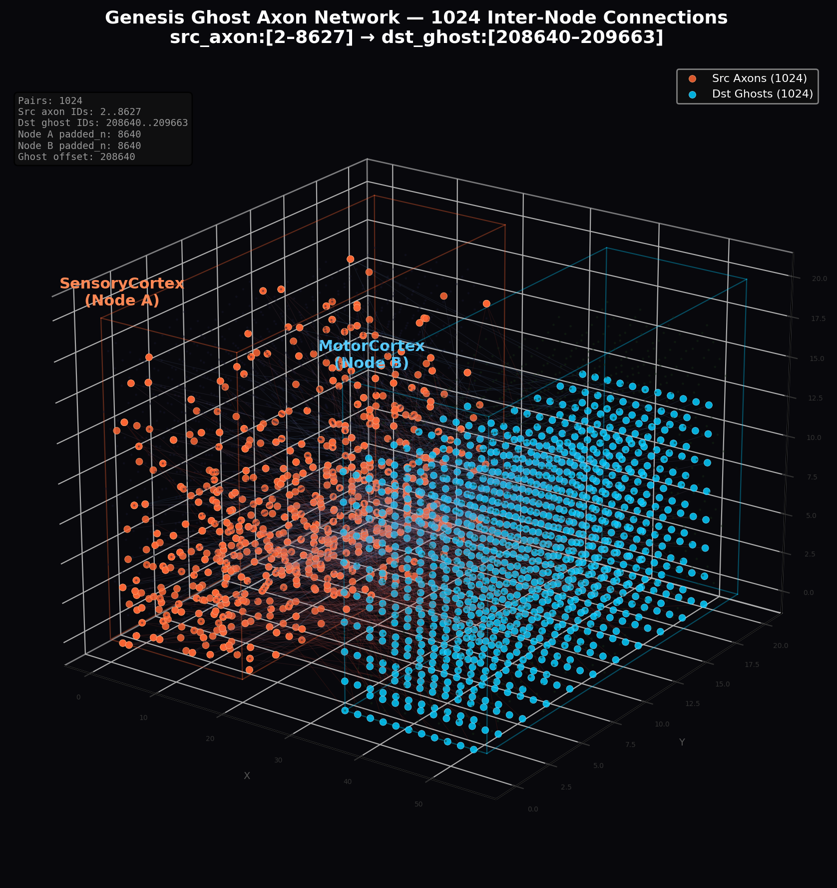

<p align="center">
  
</p>

<h3 align="center"> 🚧⚠️ UNSTABLE MVP ⚠️🚧</h3>
Все крейты находятся в состоянии нестабильного MVP.
Иногда то, что работало час назад, сейчас может не работать - и наоборот.
API, структуры данных и поведение меняются иногда без предупреждения.

**Стабилизация MVP ожидается ~Май 2026.**
До этого момента не рассчитывайте на стабильный запуск и работу.

<h1 align="center">Genesis</h1>

<p align="center">
  <strong>High-Frequency Trading (HFT) движок для Embodied AI и Spiking Neural Networks (SNN).</strong><br>
  4500 TPS on GTX 1080 Ti<br>
  430k neurons &amp; 57,6M synapses<br>
  100 microsecond sampling<br>
  14.5% of the network's one-time activity
</p>

<p align="center">
  <a href="./docs/specs/01_foundations.md">Specs</a> · <a href="#-быстрый-старт-e2e-cartpole-benchmark">Quick Start</a> · <a href="./CHANGELOG.md">Changelog</a> · <a href="./CONTRIBUTING.md">Contributing</a>
</p>

<p align="center">
  🏆 <strong>CartPole Рекорд: 71 очков</strong> (@shuanat) 3ed37ac &nbsp;|&nbsp; 
  <a href="examples/cartpole/readme.md">🏎 Попробовать побить рекорд!</a>
</p>

---

Genesis - это жёстко оптимизированный, распределённый симулятор биологической нейросети, построенный на принципах **Data-Oriented Design (DOD)** и **Механической Симпатии** к архитектуре GPU.

Наша цель - воплощённый интеллект (Embodied AI), способный обучаться в реальном времени, изменять свою физическую топологию и работать на всём: от одной RTX 4090 до кластера из сотен GPU.

---

## 🏛 Фундаментальные Законы (Project Invariants)

Любой pull request, нарушающий эти законы, отклоняется без ревью.

1.  **Integer Physics:** В горячем цикле (Hot Loop) на GPU нет `f32`. Математика мембран (GLIF) и пластичности (GSOP) сведена к `u8`, `u16`, `u32`, `i16` и `i32`. Экспоненциальное затухание (STDP) вычисляется через арифметические битовые сдвиги (`>>`). **Абсолютный детерминизм.**
2.  **Strict SoA & Columnar Layout:** Никаких структур (AoS) в VRAM. Нейронов как объектов не существует. Данные лежат плоскими колонками с выравниванием по варпам (кратность 32). Дендриты (128 слотов) хранятся поколонно для 100% Coalesced Access.
3.  **Day/Night Cycle:**
    *   **☀ Day Phase (GPU):** Топология read-only. Выполняется физика GLIF, движение сигналов и адаптация весов (GSOP). Без единой аллокации.
    *   **🌙 Night Phase (CPU):** Выгрузка VRAM, сортировка синапсов (Segmented Radix Sort), удаление слабых связей (Pruning), проращивание новых аксонов (Cone Tracing) и дефрагментация.
4.  **Strict BSP & Zero-Copy:** Сетевой обмен (Fast Path) - прямая пересылка сырого дампа памяти по UDP без десериализации. Индекс отправителя аппаратно равен готовому индексу массива на целевом GPU (Sender-Side Mapping).
5.  **Burst Architecture:** Сигнал - это не 1 бит. Это пулемётная очередь. Аксон аппаратно реализует сдвиговый регистр на 8 голов, упакованных в одну кэш-линию L1 (32 байта).

---

## 🖨 Архитектура Памяти (VRAM Layout)

Мы выжимаем 100% пропускной способности шины памяти. Раскладка стейта шарда:

```rust
// 100% Coalesced VRAM Layout (Warp Aligned, N % 32 == 0)
pub struct VramState {
    pub voltage:          *mut i32, // [N]
    pub flags:            *mut u8,  // [N] (Type_ID | is_spiking)
    pub threshold_offset: *mut i32, // [N] (Homeostasis)

    // Columnar Dendrites: 128 слотов транспонированы
    pub dendrite_targets: *mut u32, // [128 * N] (Axon_ID | Seg_Offset)
    pub dendrite_weights: *mut i16, // [128 * N] (Signed Dale's Law)

    // Burst Architecture: 32-byte alignment (1 L1 Cache Transaction)
    pub axon_heads:       *mut BurstHeads8, // [Total_Axons]
}
```

```
[ VRAM Cache Line (128 bytes) = 4 × BurstHeads8 транзакции ]
| h0..h7 (Axon 0) | h0..h7 (Axon 1) | h0..h7 (Axon 2) | h0..h7 (Axon 3) |
|---- 32 bytes ----|---- 32 bytes ----|---- 32 bytes ----|---- 32 bytes ----|
```

---

## ⚡ Ключевые Решения

| Решение | Почему |
|---|---|
| **Integer Physics** | Детерминизм, скорость, воспроизводимость на любом железе |
| **GSOP вместо STDP** | Пространственное перекрытие Active Tail, без хранения истории спайков |
| **Day/Night Cycle** | GPU - только физика. CPU - структурная пластичность. Без конфликтов |
| **Columnar SoA Layout** | 100% Coalesced Access на варп. Нет AoS, нет кэш-промахов |
| **Population Coding** | Сила = количество активных нейронов, не частота. Мгновенный отклик |
| **Pub/Sub Connectivity** | Аксон вещает. Дендрит слушает. Нет списков подписчиков на аксоне |
| **Strict BSP** | Детерминированная синхронизация шардов через барьеры |
| **Planar Sharding** | Шардирование по XY-плоскостям - топология сохраняет физическую геометрию мозга |
| **Cone Tracing** | Аксоны растут по вектору с FOV. Рождение связей через пространственный поиск |
| **Ghost Axons** | Виртуальные копии на границах шардов - межшардовая пластичность без разрывов |
| **Burst Heads** | 8-головый сдвиговый регистр - нейрон стреляет очередями без затирания предыдущих сигналов |
| **Non-linear STDP** | Экспоненциальное затухание через `cooling_shift = dist >> 4`, ноль FPU |

---

## 📦 Стек Проекта

Рабочее пространство (Workspace) состоит из 5 крейтов:

| Крейт | Роль |
|---|---|
| 🧠 **`genesis-core`** | Общие типы, константы, контракты IPC (Shared Memory) и математика физики |
| 🏗 **`genesis-baker`** | CPU-компилятор. Парсит TOML, генерирует 3D-позиции нейронов, растит аксоны (Cone Tracing) и «запекает» бинарные графы `.state` / `.axons` |
| ⚡ **`genesis-compute`** | Raw CUDA FFI. Управление VRAM, DMA-передачи и 8 вычислительных ядер (Day Phase + Sort & Prune) |
| 🌍 **`genesis-node`** | Распределённый оркестратор. Драйвит BSP-барьер, Lock-Free UDP I/O, Night Phase и IPC-туннели |
| 👁 **`genesis-ide`** | 3D-визуализатор на Bevy. Zero-cost наблюдение через WebSocket (перехват спайков для emissive glow) |
| 📚 **[`GNM-Library`](./GNM-Library/)** | Библиотека ~1800 биологически аппроксимированных типов нейронов (TOML). Кортекс из Allen Cell Types API, подкорка из литературы |

**Технологический стек:**

- **Rust** - весь движок (baker, runtime, IDE)
- **CUDA** - GPU-ядра Day Phase через FFI (`genesis-compute`)
- **Bevy** - 3D visualization (`genesis-ide`)
- **Tokio** - async runtime, WebSocket, UDP

---

## 🚀 Быстрый Старт (E2E CartPole Benchmark)

Проверь интеллект движка на классической задаче балансировки шеста. Среда (Python) общается с кластером (Rust+CUDA) через Population Coding по UDP.

### 1. Скомпилируй коннектом (Baking)

```bash
cargo run --release -p genesis-baker -- --brain config/brains/CartPole/brain.toml
```

Генерирует бинарные `.state` и `.axons` для SensoryCortex и MotorCortex.

### 2. Запусти кластер

```bash
# Terminal 1: Node 0 (SensoryCortex - Вход)
cargo run --release -p genesis-node -- \
    --manifest baked/CartPole/SensoryCortex/manifest.toml \
    --batch-size 100

# Terminal 2: Node 1 (MotorCortex - Выход)
cargo run --release -p genesis-node -- \
    --manifest baked/CartPole/MotorCortex/manifest.toml \
    --batch-size 100

# Terminal 3: Python Environment (Gymnasium)
python3 scripts/cartpole_client.py

# Terminal 4 (Опционально): 3D Визуализатор
cargo run --release -p genesis-ide
```

Если всё сделано верно, ты увидишь в консоли клиента, как система накапливает Score, а веса синапсов адаптируются в реальном времени под действием дофамина (R-STDP).

---

## 🧬 Day Phase Pipeline (GPU Hot Loop)

Каждый тик - строго последовательная цепочка CUDA-ядер. Порядок критичен:

```
┌─────────────────────────────────────────────────────────────────────┐
│ 1. InjectInputs       → Bitmask → Virtual Axon birth              │
│ 2. ApplySpikeBatch    → Ghost indices → Network Axon birth         │
│ 3. PropagateAxons     → head += v_seg (all axons, branchless)      │
│ 4. UpdateNeurons      → GLIF + 128-dendrite loop + BurstHeads8     │
│ 5. ApplyGSOP          → Non-linear STDP (cooling_shift = d >> 4)   │
│ 6. RecordReadout      → Spike flags → output_history buffer        │
└─────────────────────────────────────────────────────────────────────┘
```

**Zero allocations. Zero float. Zero branching (в варпе).**

---

## 🌙 Night Phase Pipeline (CPU Maintenance)

Периодическая per-zone фаза обслуживания. Остальные зоны продолжают работать:

| Шаг | Где | Описание |
|---|---|---|
| 1. Sort & Prune | GPU | Bitonic Sort 128 слотов по `abs(weight)`. Слабые связи → `target = 0` |
| 2. Download | PCIe | `cudaMemcpyAsync` изменённых массивов (weights + targets) |
| 3. Sprouting | CPU | Cone Tracing для пустых слотов, рост отростков, создание Ghost Axons |
| 4. Baking | CPU | Дефрагментация топологии → новый `.axons`. Warp Alignment |
| 5. Upload | PCIe | Свежие данные → VRAM. Шард мгновенно встраивается в BSP |

---

## 📜 Документация (Specs)

Полная техническая спецификация лежит в [`docs/specs/`](./docs/specs/). Рекомендуемый порядок чтения:

| # | Файл | Содержание |
|---|---|---|
| 1 | [`01_foundations.md`](./docs/specs/01_foundations.md) | Физические законы, детерминизм, метрики |
| 2 | [`07_gpu_runtime.md`](./docs/specs/07_gpu_runtime.md) | Раскладка VRAM, жизненный цикл Day/Night |
| 3 | [`05_signal_physics.md`](./docs/specs/05_signal_physics.md) | Математика CUDA-ядер: GLIF, Bursting, GSOP |
| 4 | [`06_distributed.md`](./docs/specs/06_distributed.md) | Сетевой барьер BSP и Zero-Copy роутинг |

Дополнительно:

| Файл | Содержание |
|---|---|
| [`02_configuration.md`](./docs/specs/02_configuration.md) | TOML-конфиги, Baking pipeline, SoA layout |
| [`03_neuron_model.md`](./docs/specs/03_neuron_model.md) | GLIF-модель, гомеостаз, 4-битная маска типа |
| [`04_connectivity.md`](./docs/specs/04_connectivity.md) | Cone Tracing, GSOP, Inertia Curves, Ghost Axons |
| [`08_io_matrix.md`](./docs/specs/08_io_matrix.md) | Input/Output матрицы, Population Coding |
| [`09_baking_pipeline.md`](./docs/specs/09_baking_pipeline.md) | `.state`/`.axons` формат, Sort & Prune |
| [`00_glossary.md`](./docs/specs/00_glossary.md) | Глоссарий терминов |

---

## 📊 Статус

**Pre-alpha. Активная разработка.** Текущая версия: `v0.14.13`

| Компонент | Статус | Описание |
|---|---|---|
| Спецификация | ✅ Готово | 13 документов, полная архитектура |
| `genesis-core` | 🔨 В работе | Общие типы, константы, SoA layout, IPC контракты |
| `genesis-baker` | 🔨 В работе | TOML → `.state` / `.axons` / `.positions` / `.gxi` / `.gxo` |
| `genesis-compute` | 🔨 В работе | Raw CUDA FFI, 8 Day Phase kernels, Sort & Prune |
| `genesis-node` | 🔨 В работе | BSP, UDP Fast Path, Night Phase, External I/O Server |
| `genesis-ide` | 🔨 В работе | Bevy 3D визуализатор с live telemetry |

### Верифицированные вехи

- ✅ 1M нейронов - полный E2E pipeline на реальном CUDA
- ✅ ~32k Ticks/s (1K нейронов), ~22k Ticks/s (10K), ~5k Ticks/s (100K) на GTX 1080 Ti
- ✅ Замкнутый цикл: Virtual Input → GLIF → GSOP → Output Readout
- ✅ Ghost Axon Handover (TCP Slow Path + VRAM reserve pool)
- ✅ Night Phase IPC: Shared Memory Zero-Copy между CUDA runtime и CPU Baker
- ✅ CartPole E2E benchmark (Python Gymnasium → UDP → Genesis → Motor Output)

---

## 🤝 Contributing

См. [`CONTRIBUTING.md`](./CONTRIBUTING.md). Код должен соответствовать архитектуре из `docs/specs/`.

---

## 📄 Лицензия

GPLv3 + коммерческое лицензирование. Подробности в [`LICENSE`](./LICENSE).

Cortical neuron data derived from the [Allen Cell Types Database](https://celltypes.brain-map.org)
(© 2015 Allen Institute for Brain Science). See [`GNM-Library/README.md`](./GNM-Library/README.md#credits--attribution) for full attribution.

Copyright (C) 2026 Oleksandr Arzamazov