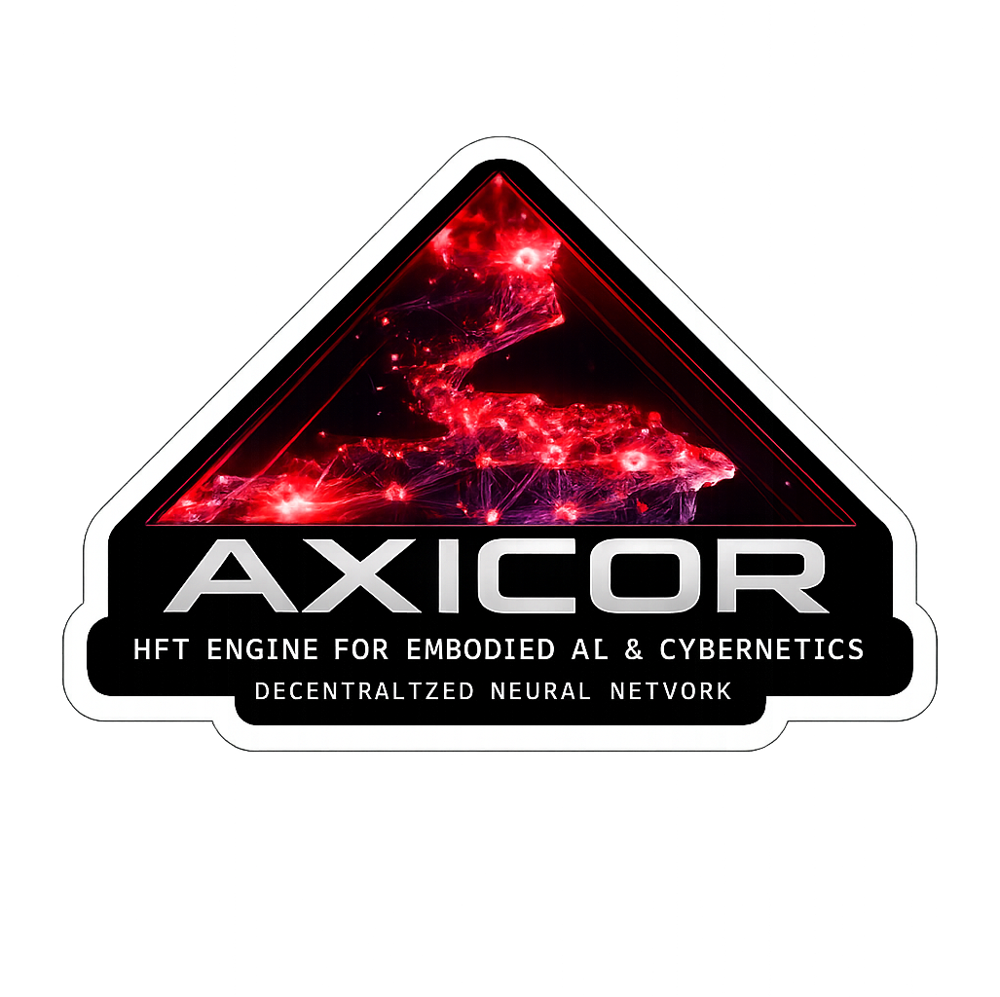

<p align="center">
  
</p>

<h1 align="center">Axicor Alpha 0.0.1</h1>

<h3 align="center">Живой мозг для роботов. Учится за секунды. Работает везде - от ESP32 до кластера.</h3>

<p align="center">
  <a href="./docs/specs/">Спецификация</a> · <a href="./CHANGELOG.md">Changelog</a> · <a href="https://t.me/+zptNJAJhDe41ZTEy">Telegram</a>
</p>

## ⚡️ Установка в одну строку

```bash
# Клонировать и настроить окружение (Linux/macOS)
git clone https://github.com/H4V1K-dev/Axicor.git && cd Axicor && ./scripts/setup.sh
```

<p align="center">
  🏆 <strong>CartPole рекорд: Score 1000+ за 18 эпизодов</strong> &nbsp;|&nbsp; PPO достигает того же за ~100 эпизодов
</p>

---

## Что это такое

Axicor - это движок для биологически-правдоподобных нейронных сетей. Не очередной ML-фреймворк поверх тензоров, а физический симулятор нейронов с настоящей структурной пластичностью.

**Главное отличие от PyTorch, JAX и прочих:**

Обычные нейросети учатся через градиентный спуск - математическую оптимизацию, которая требует остановки и прохода назад по графу. Axicor учится как мозг: нейроны стреляют спайками, аксоны физически прорастают к соседям, слабые связи обрезаются, сильные укрепляются - всё это происходит в реальном времени, без остановки симуляции.

Результат: агент начинает обучаться с первого же действия, а не после тысяч эпизодов прогрева.

---

## Почему это работает быстрее

Три инженерных решения которые отличают Axicor от академических поделок:

**Integer Physics** - вся математика нейронов в целых числах (`u8`, `u16`, `i32`). Никаких `float`. Это даёт абсолютный детерминизм и одинаковое поведение на любом железе - от RTX 4090 до микроконтроллера за $5.

**Day/Night Cycle** - GPU занимается только физикой спайков (Day Phase), CPU в это время перестраивает топологию: обрезает слабые связи, проращивает новые аксоны (Night Phase). Два процесса никогда не конкурируют за ресурсы.

**Structure of Arrays** - данные всех нейронов хранятся в плоских массивах, а не объектах. GPU читает их 100% эффективно, без единого cache miss.

---

## Результаты

### CartPole (балансировка маятника)

| Метод | Эпизодов до решения | Железо |
| :--- | :---: | :--- |
| DQN (PyTorch) | ~300 | CPU |
| PPO (stable-baselines3) | ~100 | CPU |
| **Axicor** | **18** | GTX 1080 Ti |

*Порог "решено" = средний Score ≥ 475 за 100 эпизодов
> Пока не достигнута стабилизация (Експериментальный режим)

### Производительность (GTX 1080 Ti)

| Нейронов | Синапсов | Тиков/сек | Скор. относ. RT | Примечание |
| :--- | :--- | :---: | :---: | :--- |
| **3 712** | **471 808** | **6 082** | **12.1x** | Чистый HFT |
| **362 880** | **46 448 640** | **211** | **0.42x** | вкл. 10мс среды |
| 1 000 000 | 128 000 000 | ~22 | ~0.04x | Экстраполяция |

*RT (Real-Time) = 500 TPS (2мс шаг). Все замеры для alpha 0.0.1 на GTX 1080 Ti.*

---

## 🚀 Быстрый Старт

Запустите обучающегося агента за четыре команды.

**1. Активируй окружение**
```bash
source .venv/bin/activate
```

**2. Запеки мозг**  
Компилятор читает TOML-чертёж и генерирует бинарный граф нейронов:
```bash
python3 examples/cartpole/build_brain.py
```

**3. Запусти движок**
```bash
cargo run --release -p genesis-node -- --brain CartPoleAgent
```

**4. Подключи агента**  
В новом терминале - CartPole начнёт обучаться сразу:
```bash
python3 examples/cartpole/agent.py
```

Ты увидишь как Score растёт с каждым эпизодом, синапсы прунятся и сеть адаптируется в реальном времени.

---

## Где это можно применить

**Робототехника** - управление сервоприводами и балансировка без облака. Мозг живёт прямо в устройстве.

**Микроконтроллеры** - `genesis-lite` работает на ESP32-S3 ($5) с полным Day/Night циклом. Альтернатива PID-регулятору которая сама адаптируется под изменяющиеся условия.

**Кластеры** - мозг можно физически разрезать на шарды и разнести по разным машинам. Аксоны прорастают между нодами по сети через TCP во время Night Phase. Протестировано на 1.5M нейронов / 150M синапсов на двух физических узлах.

**Нейронаука** - движок может принимать реальные коннектомы на основе (FlyWire Drosophila, Allen Cell Types Database). Можно симулировать реальные нейронные цепи.

---

## Архитектура (для тех кто хочет глубже)

Axicor - это шесть компонентов:

| Компонент | Роль | Готовность |
| :--- | :--- | :--- |
| **`genesis-core`** | Общие типы, константы, контракты IPC | ✅ |
| **`genesis-baker`** | Компилятор TOML → бинарные `.state`/`.axons` для GPU | ✅ |
| **`genesis-compute`** | CUDA/ROCm ядра, управление VRAM | ✅ |
| **`genesis-node`** | Оркестратор: BSP барьер, UDP, Night Phase | ✅ |
| **`genesis-ide`** | 3D визуализатор на Bevy (live спайки) | 🔨 |
| **`genesis-retina`** | Интерфейс машинного зрения | 🔨 |

Полная техническая спецификация в [`docs/specs/`](./docs/specs/) (14 документов) - математика, форматы бинарных файлов и контракты IPC.

---

## Статус

**Pre-alpha. Активная разработка.** Стабилизация MVP - май 2026.

- ✅ 1.5M нейронов на двух физических узлах
- ✅ CartPole E2E (Python Gymnasium → UDP → Axicor → мотор)  
- ✅ Ghost Axon Handover (аксоны прорастают между нодами)
- ✅ ESP32-S3 порт (`genesis-lite`)
- ✅ Bayesian parameter search (Optuna интеграция)
- 🔨 Альфа-релиз 15.03.2026 23:00

---

## Contributing

Читай [`CONTRIBUTING.md`](./CONTRIBUTING.md). Если хочешь - заходи в [Telegram-группу разработчиков](#) где обсуждаем архитектуру и баги.

Код должен соответствовать спецификации из `docs/specs/`. Любой PR нарушающий Integer Physics или SoA layout отклоняется без ревью - это не придирки, это физические законы движка.

---

## Лицензия

GPLv3 + коммерческое лицензирование. Открытый код - каждый может взять, запустить, встроить в своего робота.

<p align="center">Copyright (C) 2026 Oleksandr Arzamazov</p>