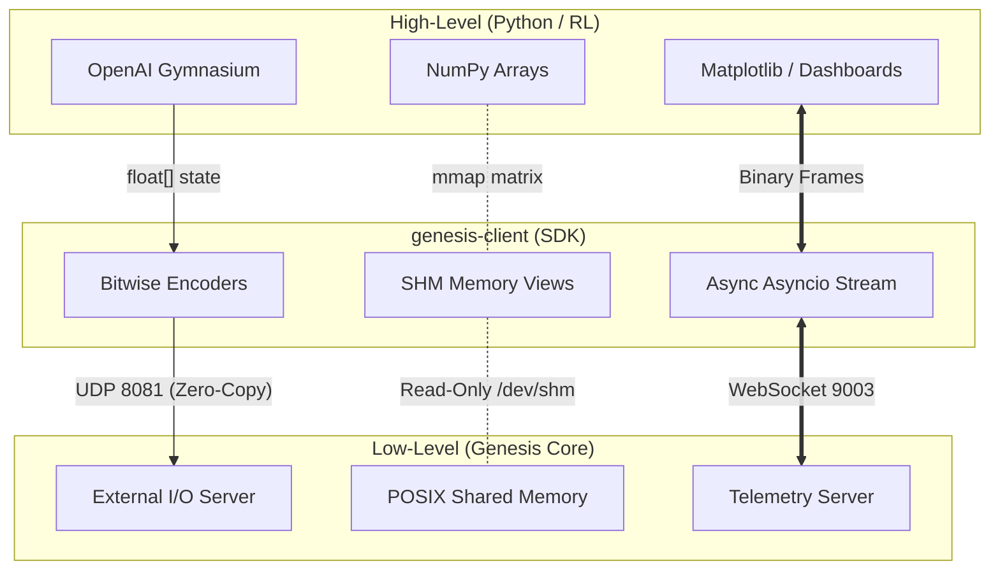
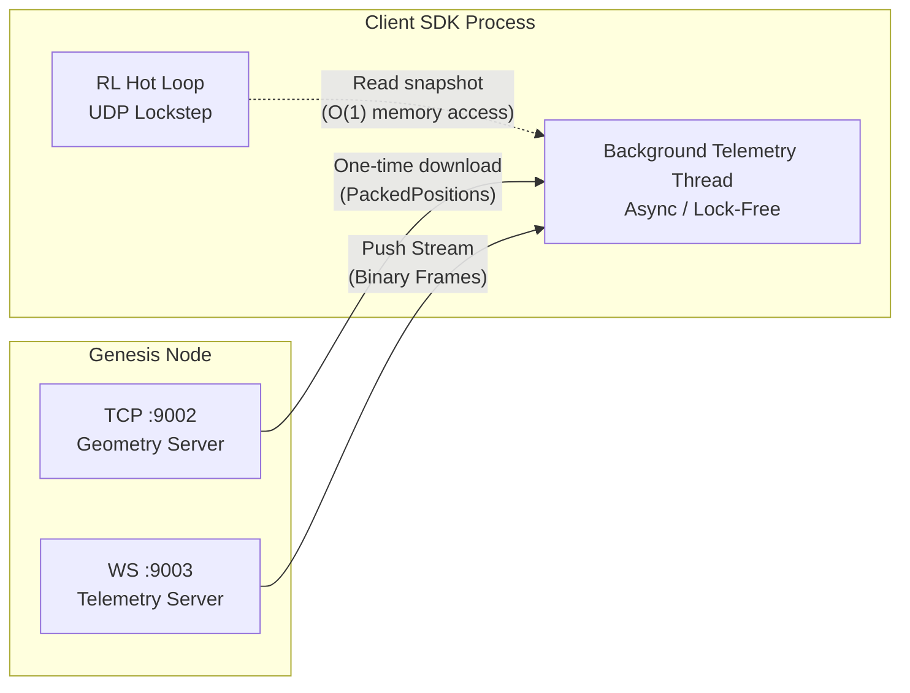
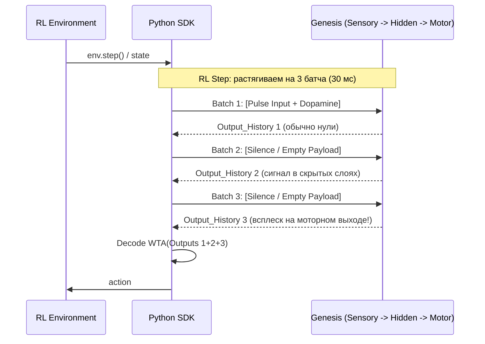

# Публичный API и SDK (genesis-client)

Спецификация интеграционного слоя Genesis. Определяет правила взаимодействия внешних сред (Python, RL-фреймворки, дашборды) с HFT-ядром симуляции.

## 1. Архитектура и Философия SDK

SDK (`genesis-client`) — это не раздутый ООП-фреймворк с тысячей классов, а тонкий Data-Oriented мост между интерпретатором (Python, RL-среды) и HFT-ядром (Rust+CUDA). Его главная задача — прокидывать данные в NumPy и обратно, не создавая мусора в куче и не замедляя шину PCIe. 

В целом, SDK превращает Genesis из "черного ящика" в прозрачную платформу, где Python работает как низкоуровневый дирижер, манипулируя сырыми байтами и разделяемой памятью.

Любые абстракции вроде `NeuronGroup`, скрывающие за собой аллокации, сериализацию в JSON/Protobuf или блокирующие gRPC-вызовы, строго запрещены. Манипуляции строятся на сырых `numpy`-массивах и `struct.pack`, что минимизирует накладные расходы на GIL (Global Interpreter Lock).

### 1.1. Маппинг концепций (Standard ML vs Genesis SDK)

Переход от классического Deep Learning (PyTorch, TensorFlow) к нейроморфному HFT-движку требует смены парадигмы. Вы больше не вызываете функции статического графа вычислений, вы общаетесь с работающим "биологическим реактором", который существует в собственном физическом времени.

SDK `genesis-client` выступает мостом между вашим высокоуровневым кодом и сырыми массивами VRAM. Чтобы вам было проще ориентироваться, мы составили карту перевода привычных ML-терминов в концепции Genesis:

**Таблица 1. Архитектурный словарь**

| Привычный ML / RL (PyTorch / Gym) | Genesis DOD Парадигма | Как это работает под капотом (Реализация) |
|---|---|---|
| `env.step(action)` | UDP Fast-Path (Data Plane) | Конвертация float-сенсоров в битовую маску `[u8]` (Population Coding) и отправка сырого UDP-пакета на порт ноды. Никакого REST или gRPC. |
| `reward` (Signal) | Dopamine Injection | Сигнал подкрепления пакуется прямо в 20-байтовый C-ABI заголовок каждого входящего UDP-пакета (`global_reward` типа `i16`). |
| `model.parameters()` | Zero-Copy Introspection | Прямой mmap файлов памяти ОС `/dev/shm/genesis_shard_*`. Доступ к `numpy.ndarray` весов синапсов за O(1) без участия рантайма Rust. |
| TensorBoard / Логи | Telemetry Stream (WS) | Бинарный push-поток сработавших ID нейронов через WebSocket. SDK распаковывает это прямо в 3D-движок или matplotlib без JSON-парсинга. |
| `model.eval()` / `train()` | Manifest Hot-Reload | Изменение порога прунинга или интервалов "Сна" в `manifest.toml` на диске. Оркестратор подхватит изменения между батчами автоматически. |



### 1.2. Почему Data-Oriented Python? (Бюджет задержек)

Скрипты на Python печально известны своей медлительностью из-за GIL (Global Interpreter Lock) и динамической типизации. Почему же мы выбрали Python для написания управляющего SDK?

Потому что при подходе Data-Oriented Design (DOD) Python используется не как исполнитель математики, а как низкоуровневый дирижер, который просто передает указатели на память в C-библиотеки и манипулирует массивами байтов через NumPy.

**Анатомия 10-миллисекундного бюджета:** Движок Genesis работает с квантом времени (тиком) равным 100 микросекунд. Стандартный шаг синхронизации со средой (`sync_batch_ticks`) составляет 100 тиков. Это значит, что у вашего Python-скрипта есть ровно **10 миллисекунд**, чтобы:

1.  Получить реакцию сети.
2.  Просчитать физику среды (например, гравитацию в CartPole).
3.  Закодировать новые входы в популяционный код.
4.  Отправить ответ обратно.

**Что убивает бюджет (Запрещенные практики):**

*   **Сериализация 100 000 спайков в JSON** занимает ~15–20 мс. Это мгновенно срывает барьер синхронизации, вызывает лаги и падение TPS всей симуляции.
*   **Создание ООП-объектов** (например, `class Spike`) в цикле вызывает сборщик мусора (GC), который замораживает процесс на непредсказуемое время.

**DOD-подход Genesis SDK:**

*   Использование векторизованных операций `np.packbits` и кастов памяти `np.frombuffer`.
*   Zero-Copy `struct.pack_into` в предварительно выделенные массивы байтов (Pre-allocation).
*   **Итог:** Обработка пакета занимает ~0.05 мс, оставляя 9.95 мс на логику вашей RL-среды.

### 1.3. Модель Исполнения: Строгий Lockstep (Strict BSP)

В отличие от классического инференса, где вызов `model.forward(x)` блокирует ваш поток до получения результата, архитектура Genesis физически разделена на независимые узлы. Взаимодействие со средой строится на строгой синхронизации BSP (Bulk Synchronous Parallel), реализованной через концепцию **Lockstep**.

Это механизм "пинг-понга", который гарантирует, что сеть и среда не разъедутся во времени, даже если работают на разных серверах.

**Как работает цикл Lockstep:**

1.  **Tx (Send):** Среда формирует батч входов (битовую маску) и отправляет его по UDP в Genesis.
2.  **Barrier (Wait):** Среда вызывает `sock.recvfrom()` и блокируется, ожидая реакции.
3.  **Autonomous GPU Compute:** Оркестратор Genesis получает батч, загружает его в VRAM и автономно прокручивает 100 тиков физики на GPU (Day Phase) без единого обращения к сети.
4.  **Rx (Receive):** По завершении батча, Genesis "выплевывает" собранную историю выходов (Output History) обратно по UDP. Среда просыпается и делает следующий шаг.

```mermaid
sequenceDiagram
    participant Env as Python RL Agent
    participant Net as UDP Socket
    participant GPU as Genesis Engine

    Note over Env,GPU: Batch N (e.g., 100 ticks = 10ms)
    Env->>Net: 1. Send [Input_Bitmask + Dopamine]
    Env->>Env: 2. Blocked on sock.recv()
    Net->>GPU: DMA Upload to VRAM
    
    rect rgb(30, 40, 50)
    Note over GPU: 3. Autonomous GPU Hot Loop
    GPU->>GPU: Tick 0: Inject Inputs
    GPU->>GPU: Tick 1-99: Propagate, GLIF, GSOP
    GPU->>GPU: Tick 99: DMA Download Outputs
    end
    
    GPU->>Net: 4. Send [Output_History]
    Net->>Env: Unblock sock.recv()
    Note over Env: Agent executes env.step()
```



**Аварийные ситуации (Biological Amnesia):** Если ваш Python-скрипт "задумался" и не прислал данные вовремя, оркестратор Genesis упрется в барьер ожидания и симуляция приостановится. Если же пакеты придут с сильным запозданием (нарушение эпохи), движок применит механизм Biological Amnesia — молча отбросит устаревшие пакеты, чтобы сохранить физиологическую достоверность текущего момента.

---

## 2. Data Plane: UDP Fast-Path (Ввод/Вывод)

### 2.1. Формат Пакета: Контракт ExternalIoHeader

Взаимодействие с движком на уровне Data Plane жестко зафиксировано в бинарном контракте (см. `genesis-core/src/ipc.rs`). Данные передаются в виде последовательности UDP-чанков. Каждый чанк предваряется строгим 20-байтовым заголовком Little-Endian.

> [!IMPORTANT]
> 20-байтовый заголовок (`<IIIIhH`) прикрепляется к **каждому** UDP-чанку. Поле `payload_size` указывает размер данных конкретного куска.

**Таблица 2. Структура заголовка ExternalIoHeader (20 байт)**

| Смещение | Поле | Тип | Значение |
|---|---|---|---|
| `0x00` | `magic` | `u32` | `0x4F495347` (GSIO) — вход, `0x4F4F5347` (GSOO) — выход. |
| `0x04` | `zone_hash` | `u32` | FNV-1a хэш имени целевой зоны. |
| `0x08` | `matrix_hash` | `u32` | FNV-1a хэш имени матрицы ввода/вывода. |
| `0x0C` | `payload_size` | `u32` | Точный размер данных в текущем UDP-пакете. |
| `0x10` | `global_reward` | `i16` | Сигнал подкрепления (Dopamine) для R-STDP. |
| `0x12` | `_padding` | `u16` | Нули (аппаратное выравнивание). |

**Типы Payload:**
1. **Вход (GSIO):** Плоская битовая маска. **1 бит = 1 виртуальный аксон**.
2. **Выход (GSOO):** Плоский массив байтов. **1 байт = 1 сома (флаг активности)**.

**Фундаментальный барьер (Lockstep):**
Клиент отправляет батч (или чанк) -> заблокировался -> получил ответ.

> [!CAUTION]
> Движок оперирует исключительно битовыми масками и сырыми байтами. Преобразование float-сенсоров, RGB-кадров или токенов в спайки (Энкодинг) и обратно (Декодинг) — зона ответственности внешних модулей клиента. SDK предоставляет только Zero-Copy транспорт для доставки сформированных байт через UDP и Shared Memory. Данные кодируются в плоский `bytearray`, на который натянут `numpy.ndarray`. Отправка идет через `memoryview` без аллокаций.

**Асимметрия и L7-Фрагментация:**
Клиент формирует массивные батчи (соответствующие одному кадру FPS), режет их на порции, чтобы влезть в UDP MTU (65507 байт минус 20 байт `ExternalIoHeader`). Нода потребляет их как непрерывный Data-Stream.

Этот подход позволяет передавать огромные объемы сенсорных данных (например, 4K видео в виде спайков) без оверхеда на TCP-хендшейки.

---

## 3. Telemetry Streamer (Наблюдаемость)

В классическом ML вызов `env.render()` часто ставит весь цикл обучения на паузу, пока процессор рисует картинку. В распределенной HFT-системе Genesis так делать категорически нельзя. Синхронное ожидание данных для отрисовки внутри горячего UDP-цикла мгновенно убьет ваш 10-миллисекундный бюджет (см. п. 1.2), оркестратор упрется в барьер и симуляция остановится.

Интроспекция в реальном времени работает по принципу Fire-and-Forget. Движок Genesis собирает данные на GPU с помощью Warp-Aggregated Atomics (без блокировки шины памяти) и асинхронно пушит их наружу через отдельные порты.

### 3.1. Архитектура потоков (Thread Isolation)

**Фундаментальное правило:** Клиент SDK обязан разносить Data Plane (UDP) и Telemetry Plane (TCP/WS) по разным потокам ОС. Ваш RL-агент крутится на максимальной скорости, а фоновый демон телеметрии просто обновляет общие переменные в памяти (Shared State), откуда UI может забирать их с комфортной частотой (например, 60 FPS).



### 3.2. Статическая Геометрия (TCP Server)

Геометрия нейронов (их физические 3D-координаты и типы) не меняется во время "Дня" (Day Phase). Поэтому SDK скачивает её ровно один раз при старте скрипта по TCP (по умолчанию порт `9002`).

**C-ABI Контракт Ответа (Little-Endian):**

| Смещение | Тип | Значение | Описание |
|---|---|---|---|
| `0x00` | `u32` | `0x4D4F4547` | Magic: "GEOM" |
| `0x04` | `u32` | `N` | Количество нейронов в дампе |
| `0x08` | `[u32; N]`| `PackedPosition` | Плоский массив данных (длина `N * 4` байт) |

**Zero-Cost Распаковка:** Чтобы не гонять по сети тяжелые float-структуры, координаты каждого нейрона запакованы в один 32-битный unsigned int. В Python это распаковывается за доли миллисекунды через векторизованные битовые сдвиги:

```python
# Раскладка PackedPosition: Type(4b) | Z(6b) | Y(11b) | X(11b)
x = (packed_array & 0x7FF) * voxel_size_um         # 11 бит
y = ((packed_array >> 11) & 0x7FF) * voxel_size_um # 11 бит
z = ((packed_array >> 22) & 0x3F) * voxel_size_um  # 6 бит
type_id = (packed_array >> 28) & 0xF               # 4 бита
```

### 3.3. Динамический Стрим Спайков (WebSocket)

Активность сети транслируется через WebSocket (порт `9003`). В конце каждого батча движок пушит бинарный фрейм, содержащий ID сработавших нейронов. Никаких JSON — только сырые числа.

**C-ABI Контракт TelemetryFrameHeader (16 байт):**

| Смещение | Тип | Значение | Описание |
|---|---|---|---|
| `0x00` | `u32` | `0x4B495053` | Magic: "SPIK" (Genesis Neuron Spike Stream) |
| `0x04` | `u64` | `tick` | Глобальный счетчик эпохи/батча |
| `0x0C` | `u32` | `C` (Count) | Количество спайков в этом кадре |
| `0x10` | `[u32; C]`| `Dense IDs` | Массив локальных ID сработавших нейронов |

**Паттерн фонового слушателя:** В SDK реализуется класс-контейнер с фоновым `asyncio`-циклом. Он принимает бинарные фреймы, применяет экспоненциальное затухание (для красивого визуального следа от спайка) и пишет новые единицы в массив тепловой карты. Главный поток просто вызывает `get_snapshot()`, не блокируя сеть.

```python
async def _ws_telemetry_loop(self):
    async with websockets.connect("ws://127.0.0.1:9003/ws") as ws:
        async for msg in ws:
            # 1. Парсинг C-ABI заголовка (16 байт)
            magic, tick, count = struct.unpack("<QII", msg[:16]) 
            
            # 2. Экспоненциальное затухание старой активности
            self.activity_heatmap *= 0.85 
            
            # 3. Инъекция новых спайков
            if count > 0:
                spike_ids = np.frombuffer(msg[16:], dtype=np.uint32)
                self.activity_heatmap[spike_ids] = 1.0 
```

### 3.4. Инвариант Lossy-Стриминга (Право на потерю)

WebSocket телеметрия в Genesis концептуально является **Lossy** (каналом с потерями).

Если ваш Python-скрипт занят рендерингом тяжелого 3D или просто подвис, буферы сокета операционной системы переполнятся, и свежие фреймы телеметрии могут быть дропнуты ОС или самим движком.

Это легализованное и ожидаемое поведение. Телеметрия создана исключительно для сэмплинга, отрисовки графиков в TensorBoard и наблюдения глазами исследователя. Она не является источником правды для градиентного спуска или RL-агента (агент получает свои данные строго через детерминированный UDP Lockstep, описанный в Разделе 2).

Физика сети на GPU останется математически идеальной и детерминированной независимо от того, тормозит ваш дашборд визуализации или нет.

---

## 4. Zero-Copy Introspection (Чтение графа весов)

В классическом ML вы привыкли вызывать `model.weights()` и получать красивые тензоры. Но передача миллионов синаптических весов по сети на каждом шаге убьёт пропускную способность (Bandwidth) любого кластера.

SDK `genesis-client` решает это радикально. Мы вообще не просим движок прислать нам веса. Мы используем системный вызов `mmap` (или `MapViewOfFile` на Windows) для прямого подключения к файлам POSIX Shared Memory, куда GPU сбрасывает данные. Это даёт O(1) доступ к синапсам через NumPy без аллокаций и без прерывания работы HFT-ядра.

### 4.1. Инвариант "Data Tearing" (Разрыв данных)

Разделяемая память (`/dev/shm/genesis_shard_{zone_hash:08X}`) доступна для чтения в любой момент времени. Но есть нюанс:

1. Во время Day Phase, когда GPU яростно перемалывает данные и применяет пластичность (GSOP), значения весов активно мутируют.
2. Чтение в этот момент абсолютно безопасно для ОС (ничего не упадет), но вы можете прочитать "грязные" (частично обновленные) данные.
3. Для отрисовки гистограмм в реальном времени это не проблема. Но для точной математической аналитики чтение должно производиться строго при остановленной симуляции или в Night Phase.

### 4.2. C-ABI Контракт и Выравнивание (ShmHeader)

Файл памяти всегда начинается с 64-байтного заголовка, выровненного по размеру L2-кэш линии процессора. **Фундаментальное правило:** Никогда не вычисляйте смещения массивов вручную через `sizeof`! Из-за аппаратных паддингов размеры могут меняться. Всегда читайте `weights_offset` и `targets_offset` из заголовка.

**Таблица 3. Структура ShmHeader (v2, 64 байта)**

| Смещение | Поле | Тип (LE) | Описание для ML-инженера |
|---|---|---|---|
| `0x00` | `magic` | `u32` | Всегда `0x47454E53` ("GENS"). Проверка целостности. |
| `...` | `...` | `...` | Служебные поля стейт-машины и версии |
| `0x08` | `padded_n` | `u32` | Кол-во нейронов (кратно 32 для GPU Warp Alignment). |
| `0x0C` | `dendrite_slots`| `u32` | Хард-лимит слотов дендритов (всегда 128). |
| `0x10` | `weights_offset`| `u32` | Смещение в байтах до матрицы весов `i16` (Shape: `[128, padded_n]`). |
| `0x14` | `targets_offset`| `u32` | Смещение в байтах до матрицы целей `u32`. |

### 4.3. The Zero-Index Trap (Упаковка целей)

Матрица `targets` содержит ID аксонов, к которым подключены дендриты. Чтобы отделить пустой слот (где нет связи) от подключения к аксону с ID 0, ядро применяет сдвиг на +1. Если вы забудете вычесть единицу, весь ваш граф сместится на один узел!

Как распаковать `u32` target:
1. Если `target == 0` — слот пуст.
2. Биты [31..24] (верхние 8 бит): Индекс сегмента на аксоне.
3. Биты [23..0] (нижние 24 бита): `Axon_ID + 1`.

### 4.4. Zero-Copy Реализация (NumPy)

Вам не нужно писать циклы на Python. С помощью аргумента `buffer` мы "натягиваем" интерфейс NumPy прямо на оперативную память ОС.

```python
import mmap
import os
import struct
import numpy as np

def analyze_weights(zone_hash: int):
    # Подключаемся к RAM-диску ОС
    path = f"/dev/shm/genesis_shard_{zone_hash:08X}"
    with open(path, "r+b") as f:
        mm = mmap.mmap(f.fileno(), 0)
        
        # 1. Читаем C-ABI заголовок (64 байта)
        padded_n, slots, w_off, t_off = struct.unpack_from("<IIII", mm, 8)
        total_slots = padded_n * slots 
        
        # 2. ZERO-COPY MAP: NumPy смотрит прямо в /dev/shm!
        weights = np.ndarray((total_slots,), dtype=np.int16, buffer=mm, offset=w_off)
        targets = np.ndarray((total_slots,), dtype=np.uint32, buffer=mm, offset=t_off)
        
        # 3. Векторизованная фильтрация "мертвых" слотов (без циклов for)
        active_mask = (targets != 0)
        live_weights = weights[active_mask]
        live_targets = targets[active_mask]
        
        # 4. Обход Zero-Index Trap (1 такт ALU на весь массив)
        axon_ids = (live_targets & 0x00FFFFFF) - 1
        segment_offsets = live_targets >> 24
        
        return live_weights, axon_ids, segment_offsets
```

---

## 5. Control Plane (Manifest Hot-Reload)

В классических симуляторах вы используете API-команды вроде `node.set_learning_rate(0.01)` или `node.pause()`. В Genesis нет и не будет никаких RPC-команд. Любой слушатель команд по сети требует введения мьютексов (Locks) в горячий цикл GPU, что мгновенно разрушит HFT-пайплайн.

Управление рантаймом осуществляется через элегантный механизм Hot-Reload на базе файловой системы.

### 5.1. Как это работает (Data Flow)

Ваш Python-скрипт просто открывает текстовый конфигурационный файл `manifest.toml` целевой зоны, меняет значение и сохраняет его. Оркестратор Genesis проверяет метаданные файла (`fs::metadata`) каждые 500 батчей. Обнаружив изменение, он без блокировок (через Atomics) обновляет настройки шарда и делает `cudaMemcpyToSymbol` для перезаливки законов физики прямо в константную память видеокарты.

```mermaid
graph LR
    subgraph Python SDK (Agent)
        FS[Write manifest.toml to Disk]
    end

    subgraph Genesis Orchestrator
        Check[Check fs::metadata\nEvery 500 batches]
        Atom[Update ShardAtomicSettings\nLock-Free]
        Cuda[cudaMemcpyToSymbol\nConstant Memory]
    end

    FS -- "OS Page Cache\n(Microsecond latency)" --> Check
    Check -- "If modified" --> Atom
    Atom --> Cuda
```

### 5.2. Что можно менять на лету?

Изменять структурные параметры (количество нейронов) нельзя — это требует перекомпиляции (Baking). Но вы можете менять параметры пластичности и циклов сна прямо во время обучения:

| TOML Путь | Тип | Описание эффекта | Ожидаемая задержка |
|---|---|---|---|
| `settings.night_interval_ticks` | `u64` | Частота наступления фазы консолидации ("Ночь"). 0 = отключить сон (актуально для инференса). | До 500 батчей |
| `settings.plasticity.prune_threshold`| `i16` | Порог выживания синапсов. Если `abs(w) < threshold` во время Ночи, связь физически удаляется. | До следующей "Ночи" |
| `variants[ID].threshold` | `i32` | Базовый порог мембраны (GLIF) для конкретного профиля нейронов. | До 500 батчей |
| `variants[ID].gsop_potentiation`| `i16` | Сила усиления связи при каузальном совпадении спайков. | До 500 батчей |

**Как применять в Python:** Вам не нужны специальные SDK-методы. Используйте встроенный модуль `tomllib` (или `toml`):

```python
import toml

# Прочли, изменили порог прунинга (ужесточили отбор), сохранили
with open("baked/SensoryCortex/manifest.toml", "r") as f:
    config = toml.load(f)

config["settings"]["plasticity"]["prune_threshold"] = 25 

with open("baked/SensoryCortex/manifest.toml", "w") as f:
    toml.dump(config, f)
# Genesis подхватит изменения автоматически через пару миллисекунд
```

### 5.3. Режим Cold Inference (Заморозка графа)

В классическом ML после обучения вы вызываете `model.eval()`. В Genesis биологическим аналогом является полная остановка нейрогенеза и синаптической пластичности. Граф сети фиксируется ("каменеет"), что высвобождает огромные вычислительные ресурсы и гарантирует строгую детерминированность ответов обученного агента.

Для перевода работающей сети в режим Cold Inference на лету, Python-клиент должен записать в `manifest.toml` следующие значения:

*   `settings.night_interval_ticks = 0`: Полностью отключает CPU-фазу "Ночь". Оркестратор перестает запускать Sort & Prune и скачивать веса по шине PCIe. Сеть больше не может отращивать новые аксоны или удалять старые.
*   `variants[ID].gsop_potentiation = 0` и `gsop_depression = 0`: Отключает изменение весов дендритов в горячем цикле. Синапсы перестают реагировать на дофамин и спайки.

**Эффект производительности:** В этом режиме HFT-оркестратор перестает синхронизироваться с фоновыми потоками `genesis-baker-daemon`. Пропускная способность (TPS) вырастает до абсолютного максимума железа, так как шина памяти GPU используется исключительно для распространения сигнала (PropagateAxons) и вычисления мембранных потенциалов (UpdateNeurons).

### 5.4. DOD-Псевдокод (Dynamic Tuning)

Python-обертка не должна держать файл открытым. Она читает TOML, модифицирует нужное значение в памяти и атомарно (или просто быстро) перезаписывает файл. Задержки диска скрываются кэшем страниц ОС (OS Page Cache).

```text
FUNCTION update_prune_threshold(manifest_path: String, new_threshold: i16):
    // 1. Читаем текущий манифест из кэша ОС
    content = OS_READ_FILE(manifest_path)
    
    // 2. Парсим структуру (например, через regex или легкий TOML-парсер)
    parsed = TOML_PARSE(content)
    
    // 3. Мутируем разрешенное поле
    parsed.settings.plasticity.prune_threshold = new_threshold
    
    // 4. Перезаписываем файл. Оркестратор подхватит сам.
    new_content = TOML_SERIALIZE(parsed)
    OS_WRITE_FILE(manifest_path, new_content)
```

### 5.5. Инвариант Атомарности Рантайма

Изменение `manifest.toml` не ломает текущий вычисляемый батч. Оркестратор загружает новые параметры строго между батчами (во время барьера BSP) и обновляет `ShardAtomicSettings` (lock-free переменные `AtomicU64` и `AtomicI16`). Это гарантирует, что все 32 потока внутри GPU-варпа всегда читают идентичные правила физики.

---

## 6. Static Graph Introspection (Анатомия и 3D-визуализация)

Исследователям и разработчикам дашбордов необходим доступ к физической 3D-морфологии сети: как нейроны расположены в пространстве и как извиваются их аксоны.

Движок Genesis в горячем цикле оперирует только плоскими индексами (Dense ID) и не знает о 3D-координатах — это экономит VRAM. Вся геометрия графа статична на протяжении всего "Дня". Она генерируется нашим компилятором `genesis-baker` до запуска симуляции и лежит в бинарных артефактах (`.pos`, `.paths`, `.gxi`, `.gxo`).

SDK позволяет читать эти файлы напрямую за O(1), что дает возможность строить 3D-рендеры (например, в Matplotlib или Bevy) вообще без нагрузки на ядро.

### 6.1. Архитектура статических артефактов

```mermaid
graph LR
    subgraph Baked Directory
        POS[.pos<br>Soma Coordinates]
        PTH[.paths<br>Axon Morphology]
        GXO[.gxo<br>Output Topology]
    end

    subgraph Python SDK (mmap / fromfile)
        S[Soma X,Y,Z]
        A[Axon Trajectories]
        M[Pixel-to-Soma Map]
    end

    POS -. "O(1) Unpack" .-> S
    PTH -. "L2 Aligned Read" .-> A
    GXO -. "Header Parsing" .-> M
```

### 6.2. Координаты Сом (.pos) и Упаковка

Файл `shard.pos` содержит плоский массив `u32` (по 4 байта на каждый нейрон). Индекс в файле строго соответствует `Dense_ID` нейрона. Чтобы не тратить 12 байт на три float, мы сжимаем 3D-вектор и тип нейрона в один `int32` (структура `PackedPosition`).

**Zero-cost распаковка на Python:**

```python
# Раскладка PackedPosition: Type(4b) | Z(6b) | Y(11b) | X(11b)
# Умножаем на размер вокселя (например, 25.0 мкм), чтобы получить реальные микроны
x_um = (packed & 0x7FF) * 25.0
y_um = ((packed >> 11) & 0x7FF) * 25.0
z_um = ((packed >> 22) & 0x3F) * 25.0
type_id = (packed >> 28) & 0xF
```

### 6.3. Морфология Аксонов (.paths) и L2-Выравнивание

Файл `shard.paths` хранит полную геометрию изгибов всех аксонов (до 256 сегментов на аксон). **Аппаратный капкан:** Для обеспечения 100% Coalesced Access на GPU, матрица сегментов внутри файла выровнена по размеру кэш-линии L2 (64 байта). Если вы попытаетесь прочитать матрицу сразу после массива длин аксонов, вы получите "мусор". Вы обязаны перешагнуть через динамический паддинг.

**Извлечение формы аксона:**

```python
def extract_axon_morphology(shard_dir: str, axon_id: int) -> np.ndarray:
    raw_bytes = np.fromfile(f"{shard_dir}/shard.paths", dtype=np.uint8)
    
    # 1. Читаем заголовок (16 байт)
    magic, version, total_axons, max_segments = struct.unpack_from('<IIII', raw_bytes, 0)
    
    # 2. Читаем длину конкретного аксона
    axon_len = raw_bytes[16 + axon_id]
    if axon_len == 0: return np.empty((0, 3))
    
    # 3. Обходим L2-Padding (Аппаратное выравнивание!)
    header_and_lengths_sz = 16 + total_axons
    padding = (64 - (header_and_lengths_sz % 64)) % 64
    matrix_offset = header_and_lengths_sz + padding
    
    # 4. Извлекаем сегменты конкретного аксона
    row_offset = matrix_offset + (axon_id * 256 * 4)
    packed_segments = np.frombuffer(raw_bytes, dtype=np.uint32, count=axon_len, offset=row_offset)
    
    # Распаковываем аналогично п. 6.2 и возвращаем массив 3D-точек
    return unpack_positions(packed_segments) 
```

---

## 7. RL Hooks: Интеграция с OpenAI Gym

Интеграция HFT-ядра (работающего на частоте 10 000 TPS) со стандартными RL-фреймворками (работающими на 60 FPS) требует изменения парадигмы. Вы не можете просто вызывать `env.step()` на каждый шаг нейросети.

### 7.1. The Death Signal (Альтернатива env.reset)

В классическом ML при провале эпизода (например, падение шеста в CartPole) вы вызываете `env.reset()`, который обнуляет память RNN/LSTM и начинает с чистого листа.

В биологической SNN обнуление весов разрушает структурную целостность графа. Сеть должна "запомнить", что это действие привело к катастрофе. Вместо очистки памяти используется паттерн **The Death Signal** (Шоковая депрессия).

При провале эпизода вы отправляете штатный UDP-пакет входов, но в заголовке `ExternalIoHeader` устанавливаете `global_reward = -255` (максимальный штраф). Движок применяет это число к D2-рецепторам всех нейронов в фазе пластичности (`ApplyGSOP`). Это вызывает массивную депрессию (LTD) на всех активных хвостах сигнала. Ошибочный моторный паттерн буквально "выжигается" из сети за одну миллисекунду, без рестарта процесса.

```python
if done:
    # Шлем пустой батч с максимальным штрафом R-STDP (-255)
    struct.pack_into("<h", tx_buf, 16, -255)
    sock.sendto(tx_buf[:20] + b'\x00'*8, ("127.0.0.1", 8081))
    state = env.reset() # Сбрасываем только физику среды, но не мозг!
```

### 7.2. Causal Delay (Причинная задержка)

В PyTorch `y = model(x)` возвращает результат мгновенно. В Genesis сигнал имеет физическую скорость (например, 0.5 м/с). Если вы "зажгли" пиксель в SensoryCortex, ответ от MotorCortex не появится в ту же секунду. Сигналу нужно время, чтобы пробить слои коры.
Python-клиент обязан удерживать временное окно (Action Repeat), ожидая отклика.

**Схема: Action Repeat Pipeline**



**Правило Single-Tick Pulse:** В первый батч вы отправляете закодированное состояние среды. Во второй и третий батчи вы обязаны отправлять нули (тишину). Если вы будете удерживать сенсоры включенными постоянно, вы перестимулируете входной слой (L4), гомеостатические пороги улетят в космос, и сеть ослепнет. Сигнал должен вспыхнуть и погаснуть, дав "хвосту" пройти по графу.

---

## 8. Execution Control (Управление жизненным циклом)

В Genesis SDK категорически отсутствуют RPC-команды вроде `node.pause()` или `node.reset()`. Любой выделенный сетевой порт для команд управления потребовал бы введения мьютексов в горячий цикл GPU, что разрушит HFT-пайплайн. Управление полностью интегрировано в Data Plane (UDP) и файловую систему.

### 8.1. Таблица трансляции управления

| Желаемое действие | Как это делается в Genesis | Механизм под капотом |
|---|---|---|
| Пауза (Pause) | Прекратить отправку GSIO пакетов | Оркестратор упирается в барьер ожидания сети (Lockstep) и засыпает на CPU. Утилизация GPU = 0%. |
| Продолжение (Resume) | Возобновить отправку GSIO | Барьер пробивается, GPU мгновенно продолжает расчеты. |
| Мягкий Сброс среды | Death Signal (`global_reward = -255`) | Мгновенный триггер LTD (депрессии) синапсов через D2-рецепторы. Сеть «забывает» ошибку без рестарта. |
| Жесткий Сброс (Wipe) | `os.kill()` процесса ноды + рестарт | Загрузка бинарников `.state`/`.axons` через `mmap` занимает миллисекунды. |
| Изменение гиперпараметров | Перезапись `manifest.toml` | Hot-Reload оркестратора атомарно обновит Constant Memory GPU (см. Раздел 5). |

---

## 9. Network Topology & Port Mapping

Для параллельного обучения (A3C, PPO) ML-инженеру необходимо запускать несколько изолированных сред на одной машине. Архитектура портов Genesis статична и предсказуема, динамическое выделение портов запрещено во избежание плавающих конфликтов (Race Conditions).

### 9.1. Архитектурная Схема (Data Flow)

```mermaid
graph TD
    subgraph Python Client / RL Agent
        PyEnv[UDP Lockstep Loop]
        PyMmap[mmap SHM Viewer]
        PyDash[WebSocket Dashboard]
    end

    subgraph Genesis Node (Rust + CUDA)
        Orchestrator[Day Phase Orchestrator]
        Geometry[Geometry TCP Server]
        Baker[Night Phase Baker Daemon]
    end

    PyEnv -- "GSIO (UDP 8081)\nInput Bitmask + Dopamine" --> Orchestrator
    Orchestrator -- "GSOO (UDP 8092)\nOutput History" --> PyEnv
    
    Orchestrator -- "WS 9003\nSpike Telemetry" --> PyDash
    Geometry -- "TCP 9002\n3D Positions" --> PyDash
    
    Baker -- "POSIX SHM\n/dev/shm/genesis_shard_*" --- PyMmap
```

### 9.2. Маппинг портов (Multiple Instances)

Для инстанса N (где N — порядковый номер агента, 0, 1, 2...) применяется жесткая формула сдвига `+ N * 10`.

| Сервис | Протокол | Базовый Порт (N=0) | Формула сдвига | Описание |
|---|---|---|---|---|
| External In | UDP | 8081 | 8081 + N*10 | Вход сенсоров (Сюда шлет SDK) |
| External Out | UDP | 8092 | 8092 + N*10 | Выход моторов (Этот порт слушает SDK) |
| Geometry | TCP | 9002 | 9002 + N*10 | Дамп 3D-координат (Однократный) |
| Telemetry | WS | 9003 | 9003 + N*10 | Стрим активности спайков |

> [!NOTE] 
> Чтобы развернуть среды, необходимо сгенерировать отдельные папки `baked/` и пропатчить секцию `[network]` в соответствующих `manifest.toml`.

---

## 10. ABI Gotchas (Для C/C++ и кастомных интеграций)

Для ML-инженеров, переписывающих клиентский код на `C/C++` ради экстремальной оптимизации (или интеграции с Unreal Engine / CUDA напрямую), необходимо строго соблюдать выравнивание памяти.

### 10.1. Выравнивание ShmHeader (64 bytes)

Genesis Engine скомпилирован с `#[repr(C)]`. Данные — Little-Endian. Заголовок разделяемой памяти `/dev/shm/genesis_shard_*` занимает ровно 1 кэш-линию L2 (64 байта).

```c
#include <stdint.h>

// Строгий контракт. Любое изменение сломает чтение памяти.
struct alignas(64) ShmHeader {
    uint32_t magic;             // 0x00: 0x47454E53 ("GENS")
    uint8_t  version;           // 0x04: 2
    uint8_t  state;             // 0x05: ShmState enum (0=Idle, 2=Sprouting)
    uint16_t _pad;              // 0x06: Padding
    uint32_t padded_n;          // 0x08: Нейроны (кратно 32 для Warp Alignment)
    uint32_t dendrite_slots;    // 0x0C: Всегда 128
    uint32_t weights_offset;    // 0x10: Смещение до i16[128 * padded_n]
    uint32_t targets_offset;    // 0x14: Смещение до u32[128 * padded_n]
    uint64_t epoch;             // 0x18: Глобальный такт
    uint32_t total_axons;       // 0x20: Local + Ghost + Virtual
    uint32_t handovers_offset;  // 0x24: Очередь AxonHandoverEvent
    uint32_t handovers_count;   // 0x28: Количество событий в очереди
    uint32_t zone_hash;         // 0x2C: FNV-1a хэш имени зоны
    uint32_t prunes_offset;     // 0x30: Смещение очереди удаления
    uint32_t prunes_count;      // 0x34: Количество prunes
    uint32_t incoming_prunes;   // 0x38: Входящие prunes от соседей
    uint32_t flags_offset;      // 0x3C: Смещение до массива u8[padded_n] (soma_flags)
}; 
```

### 10.2. Фундаментальные аппаратные ловушки

- **Dynamic Offsets**: Никогда не используйте `sizeof(Array)` для вычисления начала следующего массива. Размеры меняются из-за L2-паддингов. Всегда читайте `weights_offset` и `targets_offset` напрямую из заголовка!
- **Zero-Index Trap**: Значения внутри `dendrite_targets` смещены на +1. `axon_id = (target_packed & 0x00FFFFFF) - 1;`. Не забывайте вычитать единицу, иначе граф связей сместится на один нейрон, что приведет к необъяснимому поведению сети.


