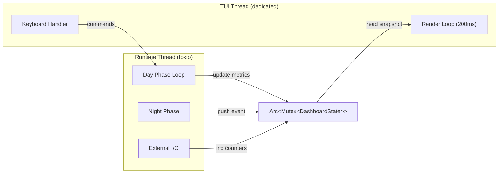

# 011 - Axicor CLI Dashboard (TUI) [PLANNED]

> Runtime monitoring & control interface built with **ratatui** + **crossterm**.
> Replaces raw `println!` output with a structured, dynamic terminal UI.

---

## 1. 

Axicor CLI Dashboard - ** **     runtime.

**:**
| # |  |  |
|---|---------|-------|
| 1 | **Zero disk I/O** |     RAM (sliding window).      . |
| 2 | **In-place rendering** |   ,  5 /.   . |
| 3 | **Graceful fallback** | `--log`   plain-text  ( CI, piping, `tee`). |
| 4 | **Data-driven** |   - read-only  `DashboardState`  RAM. |

---

## 2. 



### 2.1 `DashboardState` (RAM-only)

```rust
pub struct DashboardState {
    // --- Core Loop ---
    pub batch_number: u64,
    pub total_ticks: u64,
    pub uptime: Instant,                      // program start
    pub wall_ms_history: VecDeque<f64>,        // sliding window, capacity=60
    pub ticks_per_sec: f64,                    // computed

    // --- Per-Zone ---
    pub zones: Vec<ZoneMetrics>,

    // --- I/O ---
    pub udp_in_packets: u64,
    pub udp_out_packets: u64,
    pub oversized_skips: u64,
    pub connected_clients: u32,               // unique src addrs

    // --- VRAM (calculated) ---
    pub vram_used_mb: f64,
    pub vram_total_mb: f64,

    // --- Night Phase ---
    pub night_count: u32,
    pub night_interval_ticks: u64,
    pub global_phase: Phase,                  // Day | Night

    // --- Event Log ---
    pub events: VecDeque<LogEntry>,           // capacity=200
    
    // --- Control ---
    pub is_running: bool,                     // Start/Stop toggle
}

pub struct ZoneMetrics {
    pub name: String,
    pub short_name: String,                   // max 12 chars
    pub neuron_count: u32,
    pub axon_count: u32,
    pub spikes_last_batch: u32,
    pub spike_rate: f64,                      // spikes / neurons, 0.0..1.0
    pub phase: Phase,                         // Day | Night | Sleep
}

pub struct LogEntry {
    pub timestamp: String,                    // HH:MM:SS
    pub message: String,
    pub level: LogLevel,                      // Info | Warning | Night
}

pub enum Phase { Day, Night, Sleep }
pub enum LogLevel { Info, Warning, Night }
```

### 2.2 Threading Model

| Thread | Responsibility | Update freq |
|--------|---------------|-------------|
| **Runtime** (tokio) | Day Phase, Night Phase, I/O | per batch (~10ms) |
| **TUI** (std::thread) | Render + keyboard poll | 200ms |

Runtime   `DashboardState`  `Arc<Mutex<>>`. TUI  snapshot, ,  .

> Mutex contention : runtime lock < 1s ( ), TUI lock < 1s (clone snapshot).

---

## 3. Layout

### 3.1   ( 12040)

```
+---------------------------- GLOBAL SYSTEM STATE ----------------------------+
|  +- GENESIS -+                                                              |
|  | AGI RUNTIME|  UPTIME: 2m 14s          GLOBAL PHASE:  DAY   NIGHT #3     |
|  | DASHBOARD  |  Next night in: 1h 32m                                     |
|  +-----------+  #######################  DAY PHASE      |
+--------------------+-------------------------------+------------------------+
| CORE LOOP          | PER-ZONE NEURAL TELEMETRY     | HARDWARE & I/O         |
| PERFORMANCE        |                               | NETWORK                |
|                    | ZONE ID  NEUR   AXON   SPIKE  |                        |
|  ##   | ------ ------ ------ ------   | VRAM: 847MB / 24GB     |
|                    | Sens   6,400 72,300  0.53%   | ##  3.5%   |
| Wall: 55 ms/batch  | Hidn   5,120 48,000  0.12%   |                        |
| Throughput: 1.82M  | Motr  12,800 144k    0.89%   | UDP IN:  142 pkts      |
| Batch: #1510     |                              | UDP OUT: 1,510 pkts    |
| Ticks: 151,000     |                              |                        |
|                    |                               | [WARN] 3,020 OVERSIZED      |
+------[Start/Stop]--+--[Create]--[Load]-------------+------------------------+
| NIGHT PHASE EVENTS LOG                                                     |
| [14:47:15] Night #3: SensoryCortex                                      #   |
| [14:47:18] +- Pruned 42 inactive synapses                               #   |
| [14:47:22] +- Axon bridge metastasis complete                              |
| [14:47:29] +- Structural optimization done                                 |
| [14:47:32] +- Checkpoint saved: 2.1 MB                                     |
+-----------------------------------------------------------------------------+
```

### 3.2 Grid Distribution

|  | Position |  |
|--------|----------|--------|
| Global System State | top, full width | 5  |
| Core Loop Performance | middle-left | 30% , 10  |
| Per-Zone Telemetry | middle-center | 40% , 10  |
| Hardware & I/O | middle-right | 30% , 10  |
| Button Bar | between middle and bottom | 1  |
| Night Phase Events Log | bottom, full width | 6  (1 header + 5 content) |

### 3.3 Responsive Behaviour

|   |  |
|------------------|-----------|
|  120 cols |  layout (3 ) |
| 80-119 cols | Core Loop + Zone (2 ), I/O   |
| < 80 cols | :  .  Terminal too narrow for optimal display |

---

## 4.  - 

### 4.1 Global System State

|  |  |  |
|---------|----------|--------|
| Axicor Logo |  | ASCII art, cyan |
| Uptime | `Instant::elapsed()` | `Xh Ym Zs` |
| Global Phase | `DashboardState.global_phase` | ` DAY` / ` NIGHT` |
| Night Count | `DashboardState.night_count` | `NIGHT #N` |
| Next Night | `night_interval - (total_ticks % night_interval)`  seconds | `Xh Ym Zs` |
| Phase Bar | progress `total_ticks % night_interval / night_interval` | `########` |
| Phase Pointer | `` above the bar at current position | aligned to bar |

** Phase Bar:**
- Day region: `cyan` filled blocks
- Night threshold: `yellow` marker
- Background: `dark_gray`

---

### 4.2 Core Loop Performance

|  |  |  |
|---------|----------|--------|
| Sparkline | `wall_ms_history` (VecDeque, 60 points) | ratatui `Sparkline` widget |
| Wall ms | last value in history | `55 ms/batch` |
| Throughput | `sync_batch_ticks / wall_ms  1000` | `1.82M t/s` |
| Batch # | `batch_number` | `#1,510` |
| Total Ticks | `total_ticks` | `151,000` |

**Sparkline config:**
```rust
Sparkline::default()
    .data(&wall_ms_points)
    .max(120)                    // 120ms = red zone
    .style(Style::default().fg(Color::Cyan))
```

---

### 4.3 Per-Zone Neural Telemetry

  :

|  |  |  |
|---------|--------|--------|
| Zone ID | 12 | `SensoryCort` (truncated) |
| Neurons | 7 | `6,400` |
| Axons | 7 | `72,300` or `144k` |
| Spike Rate | 10 | mini bar + `0.53%` |
| Phase | 5 | `DAY` / `NGHT` / `SLP` |

**Spike Rate  :**
```
0.0 - 1.0%    Cyan    ( , sparse coding)
1.0 - 5.0%    Yellow  ( )
5.0%+         Red     ( )
```

**:**   > 6 . : `` `` .   6   .

---

### 4.4 Hardware & I/O Network

|  |  |  |
|---------|----------|--------|
| VRAM bar | : `(neurons  914B + axons  8B)` | `847 MB / 24 GB` + Gauge |
| UDP IN | `udp_in_packets` counter | `142 pkts` |
| UDP OUT | `udp_out_packets` counter | `1,510 pkts` |
| Oversized Alert | `oversized_skips` counter | amber box, `[WARN] 3,020 OVERSIZED` |

**VRAM Gauge:**
```rust
Gauge::default()
    .ratio(vram_used / vram_total)
    .style(if ratio > 0.8 { Color::Red } else { Color::Cyan })
```

**Oversized Alert**   `oversized_skips == 0`.    skip,  amber.

**[DOD Invariant]:**  `[ZONE] Hash: N spikes`   Zero-Copy DMA  Pinned RAM. TUI   `AtomicU32`   `LockFreeTelemetry`,       .     CPU  0    .

---

### 4.5 Button Bar

```
------[ Start]--[ Stop]--[+ Create]--[ Load]-----------------------
```

|  | Hotkey |  |  |
|--------|--------|----------|-----------|
| **Start** | `F5`  `s` | Resume Day Phase loop | Active  `is_running == false` |
| **Stop** | `F6`  `Esc` | Pause   batch | Active  `is_running == true` |
| **Create** | `F7`  `c` | [PLANNED]  Config Editor sidebar | Dimmed (v2) |
| **Load** | `F8`  `l` | [PLANNED] File picker  `baked/` dir | Dimmed (v2) |

> Start/Stop   `AtomicBool`  `DashboardState.is_running`. Runtime loop     batch.

**MVP:** Start/Stop . Create/Load  dimmed  `[PLANNED]`.

---

### 4.6 Night Phase Events Log

- **:** 6  (1 header + 5 content )
- **:** `VecDeque<LogEntry>`, capacity = 200
- **:** ``/`` (   ),  auto-scroll  
- **Format:** `[HH:MM:SS] message`

** :**

|  | Prefix |  |
|-----------|--------|------|
| Night start | `Night #N: {zone}` | yellow |
| Night sub-step | `+- ...` / `+- ...` | dim white |
| Warning | `[WARN] ...` | amber |
| Checkpoint | ` Checkpoint: X MB` | green |
| Error | ` ...` | red |

**    :**
- Batch progress (  Core Loop )
- UDP packet details (  I/O )
-  oversized warnings (  Alert box)

---

## 5.  Create - Config Editor Sidebar (PLANNED, v2)

> [!NOTE]
>    MVP.    .

  `Create`  ( )  **sidebar**  40-50 :

```
+-- CONFIG EDITOR --------------+
|  Simulation                  |
|   tick_duration_us: 100       |
|   voxel_size_um: 25           |
|   sync_batch_ticks: 100       |
|   master_seed: "GENESIS"      |
|                               |
|  Zones                       |
|    SensoryCortex (rename)    |
|    HiddenCortex              |
|    MotorCortex               |
|   [+ Add Zone]                |
|                               |
|  Connections                 |
|   Sensory  Hidden            |
|   Hidden  Motor              |
|                               |
| [Bake & Run]  [Save]          |
+-------------------------------+
```

**:**
-  (tree widget  ratatui)  expand/collapse (``/``)
-      : anatomy, blueprints, io
- Inline editing  (Enter    edit mode)
- `[Bake & Run]`   baker   runtime hot-reload
- Sidebar   `Escape`   `Create`

---

## 6.  `--log` (Fallback)

   `--log` TUI ** **.  ratatui  plain-text :

```
[15:30:01] [BATCH] #1510 | 151,000 ticks | 55ms wall | 1.82M t/s
[15:30:01] [ZONE]  SensoryCortex: 342 spikes (0.53%) | HiddenCortex: 61 (0.12%) | MotorCortex: 1140 (0.89%)
[15:30:01] [IO]    UDP IN: 142 | OUT: 1510 | Oversized: 3020
[15:47:32] [NIGHT] #3: SensoryCortex - Pruned 42, Checkpoint 2.1 MB
```

**:**
- Batch summary:  N  (  10)
- Night events: 
- Warnings: 
- : `[timestamp] [CATEGORY] message`
-   `tee -a axicor.log`  CI

---

## 7. 

```toml
# axicor-runtime/Cargo.toml
[dependencies]
ratatui = "0.29"
crossterm = "0.28"
```

 : ~200 KB.  Rust,  native  (ncurses  ).

---

## 8.  

```
axicor-runtime/src/
+-- tui/
|   +-- mod.rs              # pub fn run_tui(state: Arc<Mutex<DashboardState>>)
|   +-- state.rs            # DashboardState, ZoneMetrics, LogEntry, Phase
|   +-- layout.rs           # Grid layout computation, responsive breakpoints
|   +-- widgets/
|   |   +-- mod.rs
|   |   +-- global_state.rs # Logo + uptime + phase bar + night countdown
|   |   +-- core_loop.rs    # Sparkline + batch metrics
|   |   +-- zone_table.rs   # Per-zone table with spike bars + scrollbar
|   |   +-- io_panel.rs     # VRAM gauge + UDP counters + alert box
|   |   +-- button_bar.rs   # Start/Stop/Create/Load
|   |   +-- event_log.rs    # Night phase log with scrollbar
|   +-- input.rs            # Keyboard event handler (q, , , F5-F8, s, Esc)
+-- main.rs                 # spawns TUI thread, passes Arc<Mutex<State>>
+-- ...
```

---

## 9. Keyboard Bindings

| Key | Action | Scope |
|-----|--------|-------|
| `q` | Quit runtime + TUI | Global |
| `F5` / `s` | Start (resume) simulation | Global |
| `F6` / `Esc` | Stop (pause) simulation | Global |
| `F7` / `c` | Toggle Config Editor sidebar | Global (v2) |
| `F8` / `l` | Open Load dialog | Global (v2) |
| `` / `` | Scroll focused panel (zones or log) | Panel-specific |
| `Tab` | Cycle focus between Zone Table  Event Log | Global |
| `1` / `2` / `3` | Focus zone by index (highlight row) | Zone Table |

---

## 10. MVP Scope

| Feature | MVP (v1) | v2 |
|---------|----------|-----|
| Global State panel | [OK] | - |
| Core Loop sparkline | [OK] | Kernel timing (CUDA events) |
| Zone table | [OK] (static) | Scroll, click-to-inspect |
| I/O panel + alerts | [OK] | Per-matrix breakdown |
| Start / Stop | [OK] | - |
| Create sidebar | Dimmed button | Full config editor |
| Load dialog | Dimmed button | File picker |
| Event log | [OK] (auto-scroll) | Manual scroll, search |
| `--log` fallback | [OK] | - |
| Responsive layout | [OK] (2 breakpoints) | - |

---

## Connected Documents

| Document | Relevance |
|----------|-----------|
| [07_gpu_runtime.md](07_gpu_runtime.md) | Day/Night Phase loop that feeds metrics |
| [08_io_matrix.md](08_io_matrix.md) | UDP I/O counters, oversized packet handling |
| [08_ide.md](08_ide.md) | 3D IDE - complementary to CLI dashboard |
| [02_configuration.md](02_configuration.md) | Config structure for Create sidebar |

---

## Changelog

**v1.0 (2026-02-28)**
- Initial specification
- Layout: 4 panels + button bar + event log
- Data model: `DashboardState` with sliding windows
- Threading: `Arc<Mutex<>>` between runtime and TUI
- Keyboard: q, F5/F6 (Start/Stop), arrows, Tab
- Responsive: 3 breakpoints (120+, 80-119, <80)
- MVP: all panels functional except Create/Load (dimmed)
