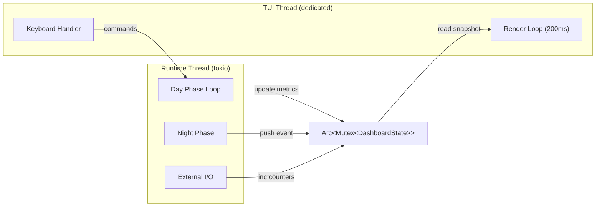

# 011 — Genesis CLI Dashboard (TUI) [PLANNED]

> Runtime monitoring & control interface built with **ratatui** + **crossterm**.
> Replaces raw `println!` output with a structured, dynamic terminal UI.

---

## 1. Обзор

Genesis CLI Dashboard — **единственный интерфейс** между оператором и работающим runtime.

**Принципы:**
| # | Принцип | Смысл |
|---|---------|-------|
| 1 | **Zero disk I/O** | Вся телеметрия живёт в RAM (sliding window). Никаких логов на диск по умолчанию. |
| 2 | **In-place rendering** | Один статичный экран, обновляемый 5 раз/сек. Терминал не скроллится. |
| 3 | **Graceful fallback** | `--log` переключает в plain-text режим (для CI, piping, `tee`). |
| 4 | **Data-driven** | Все виджеты — read-only представления `DashboardState` в RAM. |

---

## 2. Архитектура



### 2.1 `DashboardState` (RAM-only)

```rust
pub struct DashboardState {
    // --- Core Loop ---
    pub batch_number: u64,
    pub total_ticks: u64,
    pub uptime: Instant,                      // program start
    pub wall_ms_history: VecDeque<f64>,        // sliding window, capacity=60
    pub ticks_per_sec: f64,                    // computed

    // --- Per-Zone ---
    pub zones: Vec<ZoneMetrics>,

    // --- I/O ---
    pub udp_in_packets: u64,
    pub udp_out_packets: u64,
    pub oversized_skips: u64,
    pub connected_clients: u32,               // unique src addrs

    // --- VRAM (calculated) ---
    pub vram_used_mb: f64,
    pub vram_total_mb: f64,

    // --- Night Phase ---
    pub night_count: u32,
    pub night_interval_ticks: u64,
    pub global_phase: Phase,                  // Day | Night

    // --- Event Log ---
    pub events: VecDeque<LogEntry>,           // capacity=200
    
    // --- Control ---
    pub is_running: bool,                     // Start/Stop toggle
}

pub struct ZoneMetrics {
    pub name: String,
    pub short_name: String,                   // max 12 chars
    pub neuron_count: u32,
    pub axon_count: u32,
    pub spikes_last_batch: u32,
    pub spike_rate: f64,                      // spikes / neurons, 0.0..1.0
    pub phase: Phase,                         // Day | Night | Sleep
}

pub struct LogEntry {
    pub timestamp: String,                    // HH:MM:SS
    pub message: String,
    pub level: LogLevel,                      // Info | Warning | Night
}

pub enum Phase { Day, Night, Sleep }
pub enum LogLevel { Info, Warning, Night }
```

### 2.2 Threading Model

| Thread | Responsibility | Update freq |
|--------|---------------|-------------|
| **Runtime** (tokio) | Day Phase, Night Phase, I/O | per batch (~10ms) |
| **TUI** (std::thread) | Render + keyboard poll | 200ms |

Runtime пишет в `DashboardState` через `Arc<Mutex<>>`. TUI читает snapshot, рендерит, опрашивает клавиатуру.

> Mutex contention минимален: runtime lock < 1μs (запись счётчиков), TUI lock < 1μs (clone snapshot).

---

## 3. Layout

### 3.1 Полный экран (≥ 120×40)

```
┌──────────────────────────── GLOBAL SYSTEM STATE ────────────────────────────┐
│  ┌─ GENESIS ─┐                                                              │
│  │ AGI RUNTIME│  UPTIME: 2m 14s          GLOBAL PHASE: ☀ DAY   NIGHT #3     │
│  │ DASHBOARD  │  Next night in: 1h 32m   ▼                                  │
│  └───────────┘  ███████████████████████░░░░░░░░░░░░░░░░░░░░  DAY PHASE      │
├────────────────────┬───────────────────────────────┬────────────────────────┤
│ CORE LOOP          │ PER-ZONE NEURAL TELEMETRY     │ HARDWARE & I/O         │
│ PERFORMANCE        │                               │ NETWORK                │
│                    │ ZONE ID  NEUR   AXON   SPIKE  │                        │
│  ▁▂▃▅▆▇█▇▆▅▃▅▆▇█   │ ────── ────── ────── ──────   │ VRAM: 847MB / 24GB     │
│                    │ Sens…   6,400 72,300  0.53%   │ ██░░░░░░░░░░░░  3.5%   │
│ Wall: 55 ms/batch  │ Hidn…   5,120 48,000  0.12%   │                        │
│ Throughput: 1.82M  │ Motr…  12,800 144k    0.89%   │ UDP IN:  142 pkts      │
│ Batch: #1510     │                          ▓    │ UDP OUT: 1,510 pkts    │
│ Ticks: 151,000     │                          ░    │                        │
│                    │                               │ ⚠ 3,020 OVERSIZED      │
├──────[Start/Stop]──┴──[Create]──[Load]─────────────┴────────────────────────┤
│ NIGHT PHASE EVENTS LOG                                                  ▲   │
│ [14:47:15] Night #3: SensoryCortex                                      █   │
│ [14:47:18] ├─ Pruned 42 inactive synapses                               █   │
│ [14:47:22] ├─ Axon bridge metastasis complete                           ░   │
│ [14:47:29] ├─ Structural optimization done                              ░   │
│ [14:47:32] └─ Checkpoint saved: 2.1 MB                                  ▼   │
└─────────────────────────────────────────────────────────────────────────────┘
```

### 3.2 Grid Distribution

| Панель | Position | Размер |
|--------|----------|--------|
| Global System State | top, full width | 5 строк |
| Core Loop Performance | middle-left | 30% ширины, 10 строк |
| Per-Zone Telemetry | middle-center | 40% ширины, 10 строк |
| Hardware & I/O | middle-right | 30% ширины, 10 строк |
| Button Bar | between middle and bottom | 1 строка |
| Night Phase Events Log | bottom, full width | 6 строк (1 header + 5 content) |

### 3.3 Responsive Behaviour

| Ширина терминала | Поведение |
|------------------|-----------|
| ≥ 120 cols | Полный layout (3 колонки) |
| 80-119 cols | Core Loop + Zone (2 колонки), I/O под ними |
| < 80 cols | Стек: всё вертикально. Предупреждение «Terminal too narrow for optimal display» |

---

## 4. Панели — Детализация

### 4.1 Global System State

| Элемент | Источник | Формат |
|---------|----------|--------|
| Genesis Logo | статика | ASCII art, cyan |
| Uptime | `Instant::elapsed()` | `Xh Ym Zs` |
| Global Phase | `DashboardState.global_phase` | `☀ DAY` / `🌙 NIGHT` |
| Night Count | `DashboardState.night_count` | `NIGHT #N` |
| Next Night | `night_interval - (total_ticks % night_interval)` → seconds | `Xh Ym Zs` |
| Phase Bar | progress `total_ticks % night_interval / night_interval` | `████████░░░░░░` |
| Phase Pointer | `▼` above the bar at current position | aligned to bar |

**Цвета Phase Bar:**
- Day region: `cyan` filled blocks
- Night threshold: `yellow` marker
- Background: `dark_gray`

---

### 4.2 Core Loop Performance

| Элемент | Источник | Формат |
|---------|----------|--------|
| Sparkline | `wall_ms_history` (VecDeque, 60 points) | ratatui `Sparkline` widget |
| Wall ms | last value in history | `55 ms/batch` |
| Throughput | `sync_batch_ticks / wall_ms × 1000` | `1.82M t/s` |
| Batch # | `batch_number` | `#1,510` |
| Total Ticks | `total_ticks` | `151,000` |

**Sparkline config:**
```rust
Sparkline::default()
    .data(&wall_ms_points)
    .max(120)                    // 120ms = red zone
    .style(Style::default().fg(Color::Cyan))
```

---

### 4.3 Per-Zone Neural Telemetry

Таблица с колонками:

| Колонка | Ширина | Формат |
|---------|--------|--------|
| Zone ID | 12 | `SensoryCort…` (truncated) |
| Neurons | 7 | `6,400` |
| Axons | 7 | `72,300` or `144k` |
| Spike Rate | 10 | mini bar + `0.53%` |
| Phase | 5 | `DAY` / `NGHT` / `SLP` |

**Spike Rate цветовая кодировка:**
```
0.0 - 1.0%  →  Cyan    (биологическая норма, sparse coding)
1.0 - 5.0%  →  Yellow  (повышенная активность)
5.0%+       →  Red     (эпилептический шторм)
```

**Скроллбар:** появляется при > 6 зон. Управление: `↑` `↓` стрелки. Для ≤ 6 зон скроллбар скрыт.

---

### 4.4 Hardware & I/O Network

| Элемент | Источник | Формат |
|---------|----------|--------|
| VRAM bar | расчётный: `Σ(neurons × 914B + axons × 8B)` | `847 MB / 24 GB` + Gauge |
| UDP IN | `udp_in_packets` counter | `142 pkts` |
| UDP OUT | `udp_out_packets` counter | `1,510 pkts` |
| Oversized Alert | `oversized_skips` counter | amber box, `⚠ 3,020 OVERSIZED` |

**VRAM Gauge:**
```rust
Gauge::default()
    .ratio(vram_used / vram_total)
    .style(if ratio > 0.8 { Color::Red } else { Color::Cyan })
```

**Oversized Alert** скрыт при `oversized_skips == 0`. Появляется при первом skip, фон amber.

---

### 4.5 Button Bar

```
──────[▶ Start]──[⏹ Stop]──[+ Create]──[📂 Load]───────────────────────
```

| Кнопка | Hotkey | Действие | Состояние |
|--------|--------|----------|-----------|
| **Start** | `F5` или `s` | Resume Day Phase loop | Active когда `is_running == false` |
| **Stop** | `F6` или `Esc` | Pause после текущего batch | Active когда `is_running == true` |
| **Create** | `F7` или `c` | [PLANNED] Открывает Config Editor sidebar | Dimmed (v2) |
| **Load** | `F8` или `l` | [PLANNED] File picker для `baked/` dir | Dimmed (v2) |

> Start/Stop реализуются через `AtomicBool` в `DashboardState.is_running`. Runtime loop проверяет флаг перед каждым batch.

**MVP:** Start/Stop работают. Create/Load отображаются dimmed с `[PLANNED]`.

---

### 4.6 Night Phase Events Log

- **Высота:** 6 строк (1 header + 5 content строк)
- **Хранение:** `VecDeque<LogEntry>`, capacity = 200
- **Скролл:** `↑`/`↓` (когда фокус на панели), или auto-scroll к последнему
- **Format:** `[HH:MM:SS] message`

**Типы событий:**

| Категория | Prefix | Цвет |
|-----------|--------|------|
| Night start | `Night #N: {zone}` | yellow |
| Night sub-step | `├─ ...` / `└─ ...` | dim white |
| Warning | `⚠ ...` | amber |
| Checkpoint | `💾 Checkpoint: X MB` | green |
| Error | `✗ ...` | red |

**Что НЕ попадает в лог:**
- Batch progress (это в Core Loop метриках)
- UDP packet details (это в I/O счётчиках)
- Повторяющиеся oversized warnings (агрегируются в Alert box)

---

## 5. Кнопка Create — Config Editor Sidebar (PLANNED, v2)

> [!NOTE]
> Не реализуется в MVP. Описана для полноты архитектуры.

При нажатии `Create` справа (или слева) открывается **sidebar** шириной 40-50 колонок:

```
┌── CONFIG EDITOR ──────────────┐
│ ▼ Simulation                  │
│   tick_duration_us: 100       │
│   voxel_size_um: 25           │
│   sync_batch_ticks: 100       │
│   master_seed: "GENESIS"      │
│                               │
│ ▼ Zones                       │
│   ▶ SensoryCortex (rename)    │
│   ▶ HiddenCortex              │
│   ▶ MotorCortex               │
│   [+ Add Zone]                │
│                               │
│ ▼ Connections                 │
│   Sensory → Hidden            │
│   Hidden → Motor              │
│                               │
│ [Bake & Run]  [Save]          │
└───────────────────────────────┘
```

**Поведение:**
- Дерево (tree widget от ratatui) с expand/collapse (`▶`/`▼`)
- Каждая зона раскрывается в свои файлы: anatomy, blueprints, io
- Inline editing полей (Enter на поле → edit mode)
- `[Bake & Run]` → вызывает baker → обновляет runtime hot-reload
- Sidebar закрывается по `Escape` или повторному `Create`

---

## 6. Режим `--log` (Fallback)

При запуске с `--log` TUI **не запускается**. Вместо ratatui используется plain-text вывод:

```
[15:30:01] [BATCH] #1510 | 151,000 ticks | 55ms wall | 1.82M t/s
[15:30:01] [ZONE]  SensoryCortex: 342 spikes (0.53%) | HiddenCortex: 61 (0.12%) | MotorCortex: 1140 (0.89%)
[15:30:01] [IO]    UDP IN: 142 | OUT: 1510 | Oversized: 3020
[15:47:32] [NIGHT] #3: SensoryCortex - Pruned 42, Checkpoint 2.1 MB
```

**Правила:**
- Batch summary: каждые N батчей (по умолчанию 10)
- Night events: всегда
- Warnings: всегда
- Формат: `[timestamp] [CATEGORY] message`
- Подходит для `tee -a genesis.log` и CI

---

## 7. Зависимости

```toml
# genesis-runtime/Cargo.toml
[dependencies]
ratatui = "0.29"
crossterm = "0.28"
```

Общий вес: ~200 KB. Чистый Rust, нет native зависимостей (ncurses не нужен).

---

## 8. Файловая структура

```
genesis-runtime/src/
├── tui/
│   ├── mod.rs              # pub fn run_tui(state: Arc<Mutex<DashboardState>>)
│   ├── state.rs            # DashboardState, ZoneMetrics, LogEntry, Phase
│   ├── layout.rs           # Grid layout computation, responsive breakpoints
│   ├── widgets/
│   │   ├── mod.rs
│   │   ├── global_state.rs # Logo + uptime + phase bar + night countdown
│   │   ├── core_loop.rs    # Sparkline + batch metrics
│   │   ├── zone_table.rs   # Per-zone table with spike bars + scrollbar
│   │   ├── io_panel.rs     # VRAM gauge + UDP counters + alert box
│   │   ├── button_bar.rs   # Start/Stop/Create/Load
│   │   └── event_log.rs    # Night phase log with scrollbar
│   └── input.rs            # Keyboard event handler (q, ↑, ↓, F5-F8, s, Esc)
├── main.rs                 # spawns TUI thread, passes Arc<Mutex<State>>
└── ...
```

---

## 9. Keyboard Bindings

| Key | Action | Scope |
|-----|--------|-------|
| `q` | Quit runtime + TUI | Global |
| `F5` / `s` | Start (resume) simulation | Global |
| `F6` / `Esc` | Stop (pause) simulation | Global |
| `F7` / `c` | Toggle Config Editor sidebar | Global (v2) |
| `F8` / `l` | Open Load dialog | Global (v2) |
| `↑` / `↓` | Scroll focused panel (zones or log) | Panel-specific |
| `Tab` | Cycle focus between Zone Table ↔ Event Log | Global |
| `1` / `2` / `3` | Focus zone by index (highlight row) | Zone Table |

---

## 10. MVP Scope

| Feature | MVP (v1) | v2 |
|---------|----------|-----|
| Global State panel | ✅ | — |
| Core Loop sparkline | ✅ | Kernel timing (CUDA events) |
| Zone table | ✅ (static) | Scroll, click-to-inspect |
| I/O panel + alerts | ✅ | Per-matrix breakdown |
| Start / Stop | ✅ | — |
| Create sidebar | Dimmed button | Full config editor |
| Load dialog | Dimmed button | File picker |
| Event log | ✅ (auto-scroll) | Manual scroll, search |
| `--log` fallback | ✅ | — |
| Responsive layout | ✅ (2 breakpoints) | — |

---

## Connected Documents

| Document | Relevance |
|----------|-----------|
| [07_gpu_runtime.md](07_gpu_runtime.md) | Day/Night Phase loop that feeds metrics |
| [08_io_matrix.md](08_io_matrix.md) | UDP I/O counters, oversized packet handling |
| [08_ide.md](08_ide.md) | 3D IDE — complementary to CLI dashboard |
| [02_configuration.md](02_configuration.md) | Config structure for Create sidebar |

---

## Changelog

**v1.0 (2026-02-28)**
- Initial specification
- Layout: 4 panels + button bar + event log
- Data model: `DashboardState` with sliding windows
- Threading: `Arc<Mutex<>>` between runtime and TUI
- Keyboard: q, F5/F6 (Start/Stop), arrows, Tab
- Responsive: 3 breakpoints (120+, 80-119, <80)
- MVP: all panels functional except Create/Load (dimmed)
