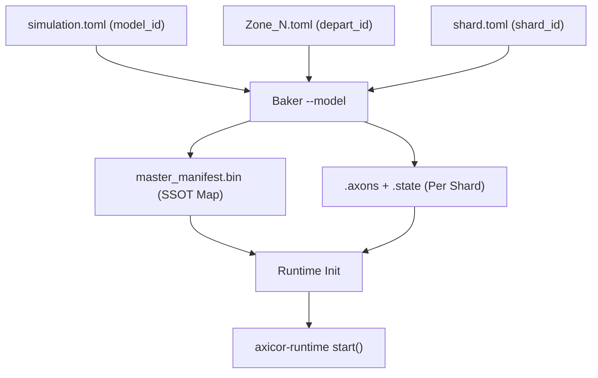

# 09. Baking Pipeline  Runtime Init

>   [Axicor](../../README.md).   I/O   runtime.
>  : [08_io_matrix.md](./08_io_matrix.md)

---

## 1. Baker Pipeline

Baker      .  :  ,  ,  ,  .

### 1.1.  A:    `.gxi`

  `[[input]]`  `io.toml`:

```
fn bake_inputs(zone, io_config) -> GxiFile:
    all_axons = []
    matrix_headers = []

    for input in io_config.inputs:
        offset = len(all_axons)
        matrix_headers.push({
            name_hash: fnv1a(input.name),
            offset, width: input.width, height: input.height,
            stride: input.stride,
        })

        for py in 0..input.height:
            for px in 0..input.width:
                //     
                spawn_x = px * zone.width / input.width
                spawn_y = py * zone.height / input.height
                spawn_z = resolve_z(input.entry_z, zone)

                // Grow ( Cone Tracing)
                seed = master_seed ^ fnv1a(input.name) ^ pixel_idx
                axon = grow_virtual_axon(
                    spawn: (spawn_x, spawn_y, spawn_z),
                    steps: input.growth_steps,
                    target: input.target_type,
                    cone: blueprints.virtual_axon_growth,
                    seed: seed,
                )

                //   
                if axon.contacts == 0:
                    if input.empty_pixel == "nearest":
                        retry   
                    else:  // "skip"
                        axon.local_id = INVALID

                all_axons.push(axon.local_id)

    return GxiFile { matrix_headers, all_axons }
```

> **:**   = row-major (`pixel_id = py * width + px`).   =    `io.toml`.

### 1.2.  B:    `.gxo`

  `[[output]]`  `io.toml`:

```
fn bake_outputs(zone, io_config) -> GxoFile:
    all_pixels = []
    matrix_headers = []

    for output in io_config.outputs:
        offset = len(all_pixels)
        matrix_headers.push({
            name_hash: fnv1a(output.name),
            offset, width: output.width, height: output.height,
        })

        for py in 0..output.height:
            for px in 0..output.width:
                //   (  Z)
                rx = px * zone.width / output.width
                ry = py * zone.height / output.height

                // :    ,   
                candidates = zone.somas_in_column(rx, ry)
                    .filter(|s| output.target_type == "All"
                             || s.type_name == output.target_type)

                //  
                seed = master_seed ^ fnv1a(output.name) ^ pixel_idx
                soma_id = if candidates.empty():
                    INVALID
                else:
                    candidates[hash(seed) % len(candidates)]

                all_pixels.push(soma_id)

    return GxoFile { matrix_headers, all_pixels }
```

### 1.3.  C:    `.ghosts`

> **:**  C  ****  A  B, ..   `.gxo` -.

  `[[connection]]`  `brain.toml`:

```
fn bake_connection(conn, src_zone, dst_zone) -> GhostFile:
    // 1.  GXO -
    src_gxo = load_gxo(src_zone, conn.output_matrix)

    // 2.   ghost-
    ghosts = []
    for gy in 0..conn.height:
        for gx in 0..conn.width:
            // : ghost-  src-
            src_px = gx * src_gxo.width / conn.width
            src_py = gy * src_gxo.height / conn.height
            paired_src_soma = src_gxo.pixel_to_soma[src_py * src_gxo.width + src_px]

            // Spawn ghost axon  -
            spawn_x = gx * dst_zone.width / conn.width
            spawn_y = gy * dst_zone.height / conn.height
            spawn_z = resolve_z(conn.entry_z, dst_zone)

            seed = master_seed ^ fnv1a(conn.from) ^ fnv1a(conn.to) ^ ghost_idx
            ghost = grow_ghost_axon(
                spawn: (spawn_x, spawn_y, spawn_z),
                steps: conn.growth_steps,
                target: conn.target_type,
                seed: seed,
            )

            ghosts.push({
                local_axon_id: ghost.local_id,     //   axon_heads[] 
                paired_src_soma: paired_src_soma,   //    -
            })

    return GhostFile { src_zone, dst_zone, width, height, ghosts }
```

> **:** `paired_src_soma` -     GXO,    ID.  . Ghost axon   .

### 1.4.  D:   Sprouting (In-place Growth)

    (   Baking,    Baker Daemon )     :

#### 1.4.1. Sprouting Density Invariant (GPU Visibility)
          CPU **   (0..127)**.
*   **:**    GPU   **Early Exit** (`if (target == 0) break;`).
*   **:**         .   Sprouting        (, 127),    10   (   ), GPU    10-        .
*   **:**      `target == 0`.

#### 1.4.2. Dead on Arrival Protection (Mass Domain Shift)
   (`initial_synapse_weight`)   `blueprints.toml`  `u16` (. 1500).    VRAM/SHM  ****    Mass Domain: `initial_weight << 16`.
*   **:**  `(initial_weight << 16) <= (prune_threshold << 16)`,      (  ),      .      (1500)          ,      .

---

## 2.  

  - little-endian,  .  =  `read()` + cast.

### 2.1. .gxi (Input Mapping)

**Format** (synced with `axicor-core/src/ipc.rs`):

```text
+--------------------------------------+
| Header (32 bytes)                    |
|   magic:         u32 = 0x47584900    |  "GXI\0"
|   zone_hash:     u32                 |  FNV-1a of zone name
|   matrix_hash:   u32                 |  FNV-1a of matrix name
|   input_count:   u32                 |  Number of virtual axons
|   total_pixels:  u32                 |  W  H
|   _padding:      u32[1]              |  Reserved; always zero
+--------------------------------------+
| Axon Array (u32 per pixel)           |
| total_pixels  4 bytes               |
|   axon_local_id: u32                 |  index in axon_heads[] GPU array
+--------------------------------------+
```

**Load path (in main.rs):**
```rust
if let Ok(parsed) = axicor_runtime::input::GxiFile::load(path) {
    vram.input_matrices = Some(parsed);  // stored in VramState
}
```

### 2.2. .gxo (Output Mapping)
Format (synced with axicor-core/src/ipc.rs):

+--------------------------------------+
| Header (32 bytes)                    |
|   magic:         u32 = 0x47584F00    |  "GXO\0"
|   zone_hash:     u32                 |  FNV-1a of zone name
|   matrix_hash:   u32                 |  FNV-1a of matrix name
|   output_count:  u32                 |  Number of mapped somas
|   _padding:      u32[2]              |  Reserved; always zero
+--------------------------------------+
| Soma Array (u32 per pixel)           |
| total_pixels  4 bytes               |
|   soma_id:       u32                 |  index in flags[] / voltage[] GPU
+--------------------------------------+

**Load path (in main.rs):**
```rust
if let Ok(parsed) = axicor_runtime::output::GxoFile::load(path) {
    vram.output_matrices = Some(parsed);  // stored in VramState
    vram.mapped_soma_ids = parsed.soma_ids.clone();  // copied to GPU
}
```

### 2.3. `.ghosts` (Inter-zone Links)

```
+-----------------------------------------+
| Header (20 bytes)                       |
|   magic:           u32 = 0x47485354     |  "GHST"
|   version:         u8  = 1              |
|   _padding:        u8[1]                |
|   width:           u16                  |
|   height:          u16                  |
|   _padding:        u8[2]                |
|   src_zone_hash:   u32                  |
|   dst_zone_hash:   u32                  |
| Ghost Array (widthheight  8 bytes)    |
|   local_axon_id:   u32                  |    axon_heads[] 
|   paired_src_soma: u32                  |     -
+-----------------------------------------+

### 2.4. .paths (Axon Full Geometry)

        2D-. 
    256 ,   `Segment_Offset`  8    `PackedTarget` (01_foundations.md 1.2).

**Format** (Little-Endian, Zero-Copy Mmap Ready):

```text
+--------------------------------------+
| Header (16 bytes)                    |
|   magic:         u32 = 0x50415448    | "PATH"
|   version:       u32 = 1             |
|   total_axons:   u32                 |
|   max_segments:  u32 = 256           | 
+--------------------------------------+
| Lengths Array                        |
|   lengths:       u8[total_axons]     |    
|   _padding:      align up to 64B     | L2 Cache Line alignment
+--------------------------------------+
| Segments Matrix (Flat SoA)           |
| total_axons  256  4 bytes          |
|   positions:     u32[A * 256]        | PackedPosition (X|Y|Z|Type)
+--------------------------------------+
```

**  (The 64-Byte Alignment Rule):**
   ,  64,  ,     SoA- (4N, 2N, 1N )   64 .          L2 -    padding bytes  .    Coalesced Access  AMD Wavefront (64 )   cache thrashing  L2.

  :   Baker Daemon (Night Phase)  `memmap2::MmapMut`. GPU       .

---

## 3. Runtime Init

### 3.1. Runtime Init: Five Components

```
fn init_runtime(config_dir: Path):
    // -- Phase 1: Config Loading --
    sim   = load("simulation.toml")
    brain = load("brain.toml")
    sync_batch_ticks = sim.simulation.sync_batch_ticks

    // -- Phase 2: Shared Network Services --
    // TCP Geometry Server (port+1): respond to neuron position queries
    geo_server = GeometryServer::bind("0.0.0.0:{port+1}")
    geo_server.spawn()  // async receiver thread

    // WebSocket Telemetry (port+2): push spike frames to IDE
    telemetry_tx = TelemetryServer::start({port+2})

    // UDP External I/O Multiplexer: dispatch ExternalIoHeader packets
    external_io = ExternalIoServer::bind(
        sim.simulation.input_port,   // default 8081
        sim.simulation.output_port   // default 8082
    )

    // -- Phase 3: Per-Zone Initialization --
    zones = Vec::new()
    for zone_entry in brain.zones:
        // 3a. Load VRAM: shard.state (neuron state) + shard.axons (topology)
        state_bytes = load("baked/{zone}/shard.state")
        axons_bytes = load("baked/{zone}/shard.axons")

        // 3b. Load Input Mapping
        gxi = GxiFile::load("baked/{zone}/shard.gxi") if exists
        alloc Input_Bitmask on GPU:
            size = sync_batch_ticks  gxi.total_pixels / 64  8 bytes  // Aligned to 64-bit words for Coalesced Access

        // 3c. Load Output Mapping
        gxo = GxoFile::load("baked/{zone}/shard.gxo") if exists
        alloc Output_History on GPU:
            size = sync_batch_ticks  gxo.total_pixels bytes
        upload gxo.soma_ids[] to GPU (for RecordOutputs kernel)

        // 3d. Build VramState and ZoneRuntime
        vram = VramState::load_shard(state_bytes, axons_bytes, gxi, gxo, ...)
        zones.push(ZoneRuntime { runtime, const_mem, config, ... })

    // -- Phase 4: IntraGPU Ghost Communications --
    intra_gpu_links = Vec::new()
    for conn in brain.connections:
        ghosts = GhostsFile::load("baked/{dst}/{}_{}.ghosts".format(src, dst))
        for g in ghosts.connections:
            intra_gpu_links.push(GhostLink {
                src_soma_id: g.paired_src_soma,  // from source zone
                dst_ghost_axon_id: ...           // to dest zone ghost array
            })
    // Build lookup table for GPU-to-GPU ghost sync inside Day Phase
    channel = IntraGpuChannel::new(intra_gpu_links)
```

> **Five components initialized:**
> 1. **GeometryServer** (TCP port+1): idle listener for IDE position requests
> 2. **TelemetryServer** (WebSocket port+2): push spike frames async
> 3. **ExternalIoServer** (UDP ports 8081-8082): multiplex zone_hash + matrix_hash
> 4. **Zones with GPU buffers**: VRAM state, input_bitmask, output_history, GXI/GXO maps
> 5. **IntraGpuChannel**: ghost links for inter-zone spike routing (CPU-local D2H/H2D)

### 3.2. Day Phase Loop

**Single Ephemeral Batch** (implemented in [axicor-runtime/src/orchestrator/day_phase.rs](../../../../axicor-runtime/src/orchestrator/day_phase.rs)):

```
fn day_phase_loop():
    // === External Input Dispatch ===
    loop:  // Drain all pending UDP packets
        match external_io.try_recv_input():
            Ok(Some((ExternalIoHeader, payload))):
                // Header: zone_hash (u32), matrix_hash (u32), payload_size (u32)
                // Find zone by zone_hash, write payload to input_bitmask_buffer
                zone = find_zone(header.zone_hash)
                if zone.runtime.vram.input_bitmask_buffer != null:
                    gpu_memcpy_host_to_device(zone.input_bitmask_buffer, payload)
            Ok(None):
                break  // No more packets
            Err(e):
                eprintln!("UDP error: {}", e); break

    // === GPU Compute Phase: sync_batch_ticks Iterations ===
    for tick in 0..sim.sync_batch_ticks:
        for zone in zones:
            // (Via CUDA stream, in [05_signal_physics.md](./05_signal_physics.md) order)
            // Kernel 1: PropagateAxons    (1.2 in 05)
            // Kernel 2: ApplySpikeBatch   (1.3 in 05) - ghost spike injection
            // Kernel 3: InjectInputs      (2.1 in 05) - if tick % stride[matrix] == 0
            // Kernel 4: UpdateNeurons     (1.5 in 05)
            // Kernel 5: ApplyGSOP        (1.3 in 05)
            // Kernel 6: RecordOutputs    (3.2 in 05)

    // === Ghost Sync (IntraGPU) ===
    // After all zones complete their Day Phase kernels
    channel.sync(zones):  // IntraGpuChannel::sync() from main.rs 5
        for ghost_link in intra_gpu_links:
            // Read flags[src_soma_id] from source zone GPU
            is_spiking = gpu_query_spike_flag(zones[src_idx], ghost_link.src_soma_id)
            
            // If spiked, inject into ghost axon in destination zone
            if is_spiking:
                gpu_inject_ghost_spike(
                    zones[dst_idx],
                    ghost_link.dst_ghost_axon_id
                )  // Sets axon_heads[dst_ghost_axon_id] = 0

    // === Output Readout & Network Delivery ===
    for zone in zones:
        // Download output_history from GPU
        gpu_memcpy_device_to_host(zone.output_history_cpu, zone.output_history_gpu)
        
        // Send to external clients via UDP (8082)
        for (matrix_idx, matrix) in zone.output_matrices.iter().enumerate():
            header = ExternalIoHeader {
                zone_hash: fnv1a_32(zone.name),
                matrix_hash: fnv1a_32(matrix.name),
                payload_size: output_history_cpu.len(),
            }
            external_io.send_output(header, output_history_cpu)
    
    // === Telemetry Push (to IDE WebSocket) ===
    telemetry_frame = SpikeFrame {
        tick: current_tick,
        spike_ids: [all somas that spiked this batch],
    }
    telemetry_tx.send(telemetry_frame)  // async  IDE ws://...8002/ws
```

> **Synchronization points:**
> - UDP recv **before** compute (hostdevice memcpy)
> - GPU compute **all zones in parallel** (same CUDA stream)
> - Ghost sync **after** compute (intra-GPU D2H/H2D)
> - Output readout **after** ghost sync (GPUhost memcpy)
> - Network sends (UDP + WebSocket) **concurrent** with next batch's compute

---

## 4. Baking Dependency Graph



**Critical dependency:** `.ghosts` generation is **Phase C** of Baking and depends on all `.gxo` files being complete. Only after all zones have their outputs, ghost connections can be computed with deterministic soma selection from source zone outputs.

## 5. Topology Distillation (Edge Export)

    (ESP32-S3)    `shard.state`  `shard.axons`   .    520  SRAM,    **Dual-Memory Split**  **Winner-Takes-All (WTA) Repacking**.

** WTA SoA Repacking:**
1. **:**  128  `dendrite_targets`, `dendrite_weights`  `dendrite_timers`.
2. **WTA Sort:**       `abs(weight)`  . -32   ,  96  (WTA Distillation).
3. **Repacking:**  32      SoA- (`32 * padded_n`).      (`target = 0`    Early Exit).
4. **Dual-Memory Split:**     :
   * **`shard.sram` (Hot State):** `voltage`, `flags`, `threshold_offset`, `timers`, `dendrite_weights` (32 ), `dendrite_timers` (32 ), `axon_heads`. /   SRAM.
   * **`shard.flash` (Read-Only):** `dendrite_targets` (32 )  `soma_to_axon`.   MMU   Flash-.

> **  MMU (64KB):**
>   `shard.flash` ****        65536  (64 KB).  `spi_flash_mmap`  ESP32     64 KB.          ,    (Core 1)     .
> * :* `pad_bytes = (65536 - (file_size % 65536)) % 65536`

---

## Connected Documents

| Document | Purpose | Status |
|----------|---------|--------|
| [05_signal_physics.md](05_signal_physics.md) | CUDA kernel specs for 6 Day Phase kernels | [OK] MVP |
| [06_distributed.md](06_distributed.md) | BSP protocol for multi-node ghost sync | [OK] MVP |
| [07_gpu_runtime.md](07_gpu_runtime.md) | VramState fields, ExternalIoServer init | [OK] MVP |
| [08_io_matrix.md](08_io_matrix.md) | Input/Output matrix semantics, CartPole example | [OK] MVP |
| [08_ide.md](08_ide.md) | GeometryServer, TelemetryServer listeners |  MVP |
| [02_configuration.md](02_configuration.md) | TOML schema for brain.toml, io.toml |  TODO |

---

## Changelog

**v1.0 (2026-02-28)**

- **9.1 (P0) Runtime Init sync**: Added ExternalIoServer, TelemetryServer, GeometryServer, IntraGpuChannel initialization (3.1)
- **9.2 (P0) Day Phase sync**: Complete rewrite of day_phase_loop with UDP dispatch, GPU kernel pipeline, ghost sync, telemetry push (3.2)
- **9.3 (P1) GXI/GXO formats**: Synced with input.rs and output.rs; added exact byte offsets, load path examples (2.1-2.2)
- **9.4 (P1) Mermaid graph**: Updated dependency graph to show brain.toml  .ghosts path; added Phase C marker
- Verified all file format constants (GXI_MAGIC, GXO_MAGIC = 0x47584900, 0x47584F00)
- Added cross-references to 05_signal_physics.md kernel specs in Day Phase loop

## 6. Slow Path Protocol (TCP GeometryServer)

     (Night Phase)  .   TCP (  8010).    `bincode`.

**GeometryRequest (Client  Server)**
Enum,  :
- `BulkHandover(Vec<AxonHandoverEvent>)`:    ,   .
- `BulkAck(Vec<AxonHandoverAck>)`:   Ghost-    (  `dst_ghost_id`  ).
- `Prune(u32)`:     ( `dst_ghost_id`     ).

**GeometryResponse (Server  Client)**
Enum,  :
- `Ack(AxonHandoverAck)`:      (  ).
- `Ok`:     ( BulkHandover  Prune).
erver)**
Enum,  :
- `BulkHandover(Vec<AxonHandoverEvent>)`:    ,   .
- `BulkAck(Vec<AxonHandoverAck>)`:   Ghost-    (  `dst_ghost_id`  ).
- `Prune(u32)`:     ( `dst_ghost_id`     ).

**GeometryResponse (Server  Client)**
Enum,  :
- `Ack(AxonHandoverAck)`:      (  ).
- `Ok`:     ( BulkHandover  Prune).
