# Foundations

> Part of the Axicor architecture. Defines the fundamental invariants of the system. Neuron model: GNM (Axicor Neuron Model), membrane mechanics: GLIF (Axicor Leaky Integer-Fire), plasticity: GSOP (Axicor Spike-Overlap Plasticity).

## 1. Units & Coordinates (Spatial and Temporal Domain)

The system operates in a hybrid coordinate system to ensure architectural scalability and precision of physical interactions.

### 1.1. Spatial Domain

> [!NOTE]
> **[Planned: Macro-3D]** Implement Nested Coordinate System for cluster scaling.

- **Micro-Space (VRAM, 32-bit):** Inside a shard, coordinates remain `PackedPosition` (11-bit X, 11-bit Y, 6-bit Z). This is a local offset.
- **Macro-Space (Cluster, 64-bit):** At the `axicor-node` orchestrator level, global absolute coordinates are introduced: `Global_X = Shard_Macro_X + Local_X`.
- **Abstraction:** The GPU knows nothing about macro-position. The network layer "rewires" the sender's local coordinates into the receiver's local coordinates when transmitting a `GhostPacket`, relying on their 64-bit macro-offsets.
- **Absolute unit:** 1.0 (float) = **1 m** (micrometer).
  - Used for: diffusion physics calculation, axon lengths, dendrite search radii, and velocities.
  - Why: This allows the use of real neurobiological constants without magic coefficients.
- **Relative unit (Normalization):** 0.0 ... 1.0 (pct).
  - Used for: defining layer boundaries (`Layers`) and zone topology.
  - Logic: The L1 layer can occupy 0.0 - 0.1 (10% of height). This value is multiplied by `world.height` (in m) during initialization. This allows resizing the "brain" without rewriting the layer architecture.
- **Discretization (Grid):** Space is quantized into **voxels** (size is specified in the configuration, e.g., 10 m).
  - Used for: optimizing collisions and neighbor search (Spatial Hashing).

### 1.2. Axon Segmentation

To save memory, we do not store every voxel of the path. An axon is a chain of **Segments**.

- **Parameter:** `segment_length_voxels` (e.g., 4 voxels = 100 m with a 25 m voxel).
- **Logic:**
  - An axon grows in "steps". One growth step adds one Segment to the geometry array.
  - **Identification:** A Segment is a unit of interaction. A dendrite connects not to (X, Y, Z) coordinates, but to an `Axon_ID` + `Segment_Index` pair.
  - **Storage:** Only the list of nodal points (segment starts) is stored in memory. The space between them is considered a straight line (or interpolated) for collisions.
- **Optimization:** Reduces memory consumption by `segment_length_voxels` times. Instead of 1000 records per 1 mm of path (at 1 m resolution) - only **10 records** (with a 100 m segment).

1.3. Signal Physics: Active Tail
The signal is not a point (not a single bit). It is a "packet" of energy that has a length.

Parameter: signal_propagation_length (tail length in segments).
Mechanics:

The signal is a "train" moving on rails (segments).
If signal_propagation_length = 3, then at time T segments [i, i+1, i+2] are active.
At time T+1 the "train" shifts by the signal speed v: [i+v, i+v+1, i+v+2] are active.


Rationale: Ensures that even at high speed, the signal will not "jump over" a dendrite. The dendrite will have time to detect contact with the "tail".

Visualization: Movement on the timeline
Let v_seg = 1 (1 segment/tick), propagation_length = 3 (3 segments):



Each tick:

head shifts forward by v_seg positions.
The active range is [head - propagation_length + 1, head].
Dendrites connected to segments within the active range receive the signal.

### 1.4. Temporal Domain

- **Time quantum:** 1 Tick.
- **Resolution:** `tick_duration_us` = 100 (0.1 ms).
  - Rationale: 1 ms is too "coarse" for GSOP (spike order is lost). 100 s is the bare minimum for causality.
  - All timers (refractoriness, decay) are specified in u64 ticks.
  - Example: Refractoriness 5 ms = 50 ticks.

### 1.5. Pre-calculated Derived Quantities

We move math out of the Hot Loop. We write human-readable quantities (m/s, m, ms) in the configs, but the engine recalculates them into "raw" constants for the GPU at startup.

**Derived Quantities Table:**

<table>
<thead>
<tr>
  <th>Output quantity</th>
  <th>Input parameters</th>
  <th>Formula</th>
  <th>Example</th>
  <th>Purpose</th>
</tr>
</thead>
<tbody>
<tr>
  <td><code>signal_speed_um_tick</code></td>
  <td><code>signal_speed</code>, <code>tick_duration_us</code></td>
  <td><code>speed_m_s  1e6  tick_us  1e-6</code></td>
  <td><code>0.5 m/s  100s = 50 m/tick</code></td>
  <td>Absolute displacement of signal head per tick</td>
</tr>
<tr>
  <td><code>segment_length_um</code> <em>(intermediate)</em></td>
  <td><code>voxel_size_um</code>, <code>segment_length_voxels</code></td>
  <td><code>voxel_size  seg_length_voxels</code></td>
  <td><code>25m  2 = 50m</code></td>
  <td>Intermediate for <code>v_seg</code></td>
</tr>
<tr>
  <td><code>v_seg</code> <strong>(hot loop)</strong></td>
  <td><code>signal_speed_um_tick</code>, <code>segment_length_um</code></td>
  <td><code>speed_um_tick  seg_length_um</code></td>
  <td><code>50  50 = 1 seg/tick</code></td>
  <td>GPU cycle shift index: <code>head += v_seg</code></td>
</tr>
<tr>
  <td><code>matrix_spatial_scale</code></td>
  <td><code>zone_width_um</code>, <code>matrix_width_px</code>,
      <code>zone_depth_um</code>, <code>matrix_height_px</code></td>
  <td><code>(width_um/width_px, depth_um/height_px)</code></td>
  <td><code>(1000/64, 1000/64) = (15.625, 15.625)</code></td>
  <td>Pixel  zone territory projection scale</td>
</tr>
</tbody>
</table>

### 1.6. Critical Parameter Linkage (Math Check)

Signal speed and segment length are rigidly linked quantities. If the link is broken, the physics break down.

- **Invariant:** `signal_speed_um_tick` MUST be a multiple of `segment_length_um`.
  - Speed in segments/tick: `v_seg = signal_speed_um_tick / segment_length_um`  integer.
  - If `v_seg` is fractional (e.g., 1.5 segments/tick) - the tail position requires float arithmetic, interpolation, and shader complexity. For the GPU, this is unacceptable.
- **Mechanics:** In one tick, the "train" (Active Tail, 1.3) shifts by exactly `v_seg` segments. No fractional positions - pure u32 index shift.
- **Fixed Configuration:**

| Parameter | Value | Unit |
| :--- | :--- | :--- |
| `tick_duration_us` | 100 | s (0.1 ms) |
| `voxel_size_um` | 25 | m |
| `segment_length_voxels` | 2 | voxels (= 50 m) |
| `signal_speed_um_tick` | 50 | m/tick (= 0.5 m/s) |
| `v_seg` | 1 | segment/tick |

- Verification: 50 m/tick  50 m/segment = 1  (integer).
- Biological correspondence: 0.5 m/s is a realistic speed for unmyelinated axons in the cortex.

#### 1.6.1. Order of v_seg Calculation

The complete chain for calculating discrete speed from config parameters:

1. **Segment size in micrometers:** `segment_length_um = voxel_size_um  segment_length_voxels`
   `segment_length_um = 25 m  2 = 50 m`
2. **Discrete speed (segments/tick):** `v_seg = signal_speed_um_tick  segment_length_um`
   `v_seg = 50 m/tick  50 m/segment = 1 segment/tick`
3. **Integer Verification:** `assert!(signal_speed_um_tick % segment_length_um == 0)`
   `assert!(50 % 50 == 0)` 

If not an integer is calculated at Step 3 - the configuration is invalid and must be rejected during initialization.

**Rule:** When changing any of these four parameters, it is necessary to recalculate `v_seg` and ensure it remains an integer.

### 1.7. Fundamental Memory Invariants (C-ABI)

The Axicor engine relies on two rigidly fixed data density calculations. Any deviation from these formulas destroys the Zero-Copy mmap contracts.

#### 1.7.1. The 1166-Byte Invariant (VRAM/State)

The size of the full state of one neuron in video memory and in the `.state` file. Formula: `Soma (14) + 128 * (Targets:4 + Weights:4 + Timers:1) = 1166 bytes`.

- **Soma (14B):** Voltage(4) + Flags(1) + Threshold(4) + Timer(1) + SomaToAxon(4).
- **Dendrites (1152B):** 128 slots, each 9 bytes (Target Axon ID & Offset, 32-bit Weight, 8-bit Synaptic Timer).

#### 1.7.2. SHM Night Phase IPC v4 (Exchange)

The size of the data block in Shared Memory per neuron during the Night Phase. Formula: `Header(64) + Weights(N * 512) + Targets(N * 512) + Flags(N * 1) = 1025 bytes per neuron`.

- Weights (i32) and targets (u32) occupy 4 bytes per slot (128 slots = 512 bytes).
- Soma flags are transmitted to control growth activity (Activity Gate).

**Implementation:** All calculations are encapsulated in `axicor_core::physics::compute_derived_physics()` - the canonical implementation for calculating derivatives from raw parameters.

**Recalculation Pipeline (Startup  GPU):**

Concrete example with config:

- In `simulation.toml`: `signal_speed` = 0.5 m/s, `tick_duration` = 100 s
- Engine calculates: `signal_speed_um_tick` = 50 m/tick
- The number 50 is loaded into GPU memory
- Neuron in the hot loop adds: `axon_head += 50` (not Speed  Time)

For discrete speed (`v_seg`):

- In config: `segment_length_voxels` = 2, `voxel_size_um` = 25
- Engine calculates: `segment_length_um` = 50 m
- Then: `v_seg` = 50 m/tick  50 m = 1
- The number 1 is loaded into GPU memory
- Hot loop: `segment_head += 1` (pure u32 shift)
- Active Tail (1.3) is the range `[head - propagation_length .. head]`, shifted by `v_seg` every tick.

---

## 2. Global Determinism (Master Seed)

Without this, debugging a distributed system is impossible. A "floating bug" on a cluster of 10 machines is unrealistic to find. If a bug surfaces - save the `master_seed`, and the bug is reproduced by any developer on any machine.

### 2.1. Configuration

- **Parameter:** `master_seed` (String) in `simulation.toml`.
- **String Type:** The string is hashed into u64 at startup. This does not affect performance (one-time operation), but allows using readable seeds: "GENESIS", "HELLO_WORLD", "DEBUG_RUN_42". (Note: The default engine seed remains "GENESIS" for compatibility).
- **Rule:** This is the only entropy entry point. There must be no `time(NULL)`, `std::random_device`, or `SystemTime::now()` in the code.

```toml
[simulation]
master_seed = "GENESIS"
```

### 2.2. Implementation (Stateless Hashing)

You cannot create a single `Random(seed)` generator and call `.next()`. In a multithreaded environment (and even more so on different machines) the order of `rand()` calls is unpredictable - the result depends on the thread scheduler.

- **Method:** Hashing, not sequential generation.
- **Formula:** `Local_Seed = Hash(Master_Seed_u64 + Unique_Entity_ID)`
  - Example: The properties of neuron #5001 are always calculated as `WyHash64(Seed + 5001)`.
  - Algorithm: WyHash64 - fast, collision-resistant, deterministic.
- **Why it works:** Generation is tied to `Entity_ID`, not the execution order. The world can be generated in chunks (shards) in any order, and neuron #5001 will always be the same - no matter if it was created first or millionth.

### 2.3. Guarantees (Structural Determinism)

- **Initialization:** The exact same `master_seed` + exact same configs = bit-exact identical starting graph (coordinates, types, axons, UV-projections). Hardware independence: generation on 1 CPU core and on a cluster of 100 GPUs yields the same result.
- **Hot Loop (Day):** Within a single "Day", GLIF physics and GSOP plasticity are deterministic - Integer Physics guarantees identical behavior on any GPU.
- **Evolution:** If the system is run on different hardware, after a day of real time, the graphs will diverge. A fast GPU = fast metabolism = more Night cycles = different experience. This is legalized: different hardware = different life of the creature, not a bug.
- **Backend Diversity:** [MVP] AMD ROCm/HIP natively supported - determinism confirmed. The `axicor-compute` engine operates hardware-natively on both NVIDIA (CUDA) and AMD (Polaris/RDNA), producing a bit-exact identical result given the same `master_seed`. See: [Hardware Backends](../reference/hardware-backends.md).
- **Debugging:** A bug reproduces deterministically within the same configuration - just provide the `master_seed`, config versions, and the `night_cycle_count` log.
